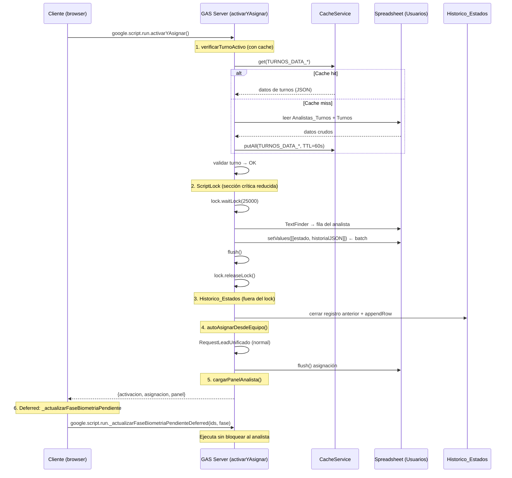

# Design Document: Optimización del Flujo de Activación

## Overview

Este diseño aborda la optimización del flujo de activación de analistas en la aplicación de Google Apps Script de asignación de análisis. El flujo actual (`activarYAsignar`) tarda ~18 segundos end-to-end. El objetivo es reducirlo a ~10-12 segundos sin alterar la semántica funcional.

**Flujo actual (secuencial, single round-trip):**
1. `actualizarEstadoPropio('ACTIVO')` — ~4.35s (incluye verificarTurnoActivo ~2.4s + ScriptLock ~1.82s)
2. `autoAsignarDesdeEquipo()` — ~7-8s (motor de asignación con VIP/score)
3. `cargarPanelAnalista()` — ~4-5s (lectura de datos para renderizar tabla)

**Cuello de botella identificado:**
- `verificarTurnoActivo`: 2 lecturas completas de hojas (Analistas_Turnos + Turnos) = ~2.4s
- ScriptLock en `actualizarEstadoPropio`: 2 setValue individuales + Historico_Estados scan+appendRow = ~1.82s dentro del lock
- `_actualizarFaseBiometriaPendiente`: ~6s post-asignación ejecutándose de forma bloqueante en el mismo server call

**Estrategia de optimización:**
1. Cache de turnos con CacheService (ahorra ~2.2s)
2. Batch writes en Usuarios (ahorra ~150-200ms dentro del lock)
3. Mover Historico_Estados fuera del lock (ahorra ~700ms de contención)
4. Usar `_abrirSSCacheado` en biometría (ahorra ~2s si ya estaba memoizada)
5. Batch writes en `_actualizarFaseBiometriaPendiente` (ahorra ~1-2s con N filas)
6. Ejecución no-bloqueante de `_actualizarFaseBiometriaPendiente` (ahorra ~4-6s percibidos)

**Ahorro estimado total en path crítico:** de ~18s a ~10-12s (6-8s ahorrados).

## Architecture

### Diagrama de Flujo Optimizado



### Decisiones Arquitectónicas

| Decisión | Rationale |
|----------|-----------|
| CacheService con chunking para turnos | Mismo patrón probado en `_getDataUsuarios`. TTL de 60s equilibra frescura vs latencia. Los turnos cambian raramente (admin configura). |
| Batch `setValues()` para Usuarios | Google Sheets es ~40% más rápido con un solo rango vs 2 `setValue()`. Reduce la ventana del lock. |
| Historico_Estados fuera del lock | No requiere exclusión mutua: cada analista escribe su propio registro. Si falla, el estado ya se guardó correctamente — solo se pierde auditoría temporal. |
| `_abrirSSCacheado` en biometría | Ya existe la función de memoización por ejecución. Reutilizarla es zero-cost si el ID ya fue abierto antes en el mismo server call. |
| Client-side deferred pattern | Google Apps Script no tiene `async/await` ni Workers server-side. El único mecanismo no-bloqueante disponible es un `google.script.run` adicional desde el cliente sin success handler bloqueante. |

## Components and Interfaces

### 1. Módulo de Cache de Turnos

**Nuevas funciones:**

```javascript
/**
 * Lee datos de Analistas_Turnos y Turnos desde CacheService o, en caso de miss,
 * desde las hojas del spreadsheet. Almacena en caché con TTL=60s.
 * Usa chunking si el payload excede 90KB por chunk (igual que _getDataUsuarios).
 *
 * @param {Spreadsheet} ss - Spreadsheet ya abierta (TARGET_SOLICITUDES_SS_ID)
 * @returns {{ dataAT: Array, dataTurnos: Array, dispTurnos: Array }}
 */
function _getTurnosDataCacheado(ss) {}

/**
 * Invalida el caché de turnos. Se invoca desde funciones admin que modifican
 * la configuración de turnos.
 */
function _invalidarCacheTurnos() {}
```

**Constantes:**
```javascript
const _TURNOS_CACHE_PREFIX = 'TURNOS_DATA_V1_';
const _TURNOS_CACHE_TTL = 60; // segundos
const _TURNOS_CACHE_TAM_CHUNK = 90000; // bytes por chunk
```

### 2. `actualizarEstadoPropio` refactorizado

**Cambios:**
- `verificarTurnoActivo` usa `_getTurnosDataCacheado` internamente
- Dentro del lock: una sola llamada `setValues()` para columnas F y L de Usuarios
- Fuera del lock: bloque Historico_Estados con try/catch que no afecta el resultado
- Flush se ejecuta dentro del lock (necesario para garantizar la escritura de estado)

**Interfaz pública sin cambios:** `actualizarEstadoPropio(nuevoEstado)` → `{success, message}`

### 3. `_actualizarFaseBiometriaPendiente` optimizado

**Cambios internos:**
- Usa `_abrirSSCacheado(ID_SHEET_BIOMETRIA_PENDIENTE)` en vez de `SpreadsheetApp.openById()`
- Acumula actualizaciones y las aplica con `Range.setValues()` o `RangeList` en un batch
- Para fila única: un solo `setValues()` de 1×2 (fase + fecha)

**Nueva función expuesta al cliente:**
```javascript
/**
 * Wrapper público para ejecutar _actualizarFaseBiometriaPendiente de forma
 * deferred desde el cliente. El cliente la invoca con google.script.run
 * sin bloquear la respuesta principal.
 *
 * @param {Array<string>} ids - Consecutivos a actualizar
 * @param {string} fase - Nueva fase ("ASIGNADA", "RESUELTA_EN_COLA", etc.)
 */
function actualizarFaseBiometriaPendienteDeferred(ids, fase) {}
```

### 4. Cambios en `activarYAsignar`

**Antes:** ejecutaba `_actualizarFaseBiometriaPendiente` dentro de `autoAsignarDesdeEquipo()` → `RequestLeadUnificado`.

**Después:** `RequestLeadUnificado` retorna los IDs asignados como metadata, y `activarYAsignar` los incluye en la respuesta para que el cliente dispare la actualización de fase de forma deferred.

Interfaz de respuesta ampliada:
```javascript
{
  activacion: { success, message },
  asignacion: { success, message, nueva, idsAsignados, faseTarget },
  panel: { ... }
}
```

### 5. Cambios en el Cliente (main.js.html)

En el success handler de `activarYAsignar`:
```javascript
// Después de procesar la respuesta principal:
if (r.asignacion && r.asignacion.idsAsignados && r.asignacion.idsAsignados.length > 0) {
  google.script.run
    .actualizarFaseBiometriaPendienteDeferred(
      r.asignacion.idsAsignados, 
      r.asignacion.faseTarget
    );
  // Sin .withSuccessHandler — fire-and-forget
}
```

## Data Models

### Cache de Turnos (CacheService)

| Key | Valor | TTL |
|-----|-------|-----|
| `TURNOS_DATA_V1_COUNT` | Número de chunks (string) | 60s |
| `TURNOS_DATA_V1_0` | JSON chunk 0 del payload | 60s |
| `TURNOS_DATA_V1_1` | JSON chunk 1 (si aplica) | 60s |

**Payload serializado:**
```json
{
  "dataAT": [[email, idTurno, desde, hasta], ...],
  "dataTurnos": [[id, nombre, activo, lun, mar, ...], ...],
  "dispTurnos": [["id", "nombre", ...display values...], ...]
}
```

**Nota de tamaño:** Con ~40 analistas y ~10 turnos definidos, el payload típico es ~15-30KB (cabe en 1 chunk). El chunking es defensivo para casos de crecimiento.

### Escritura batch en Usuarios (actualizarEstadoPropio)

**Antes (2 llamadas):**
```javascript
hojaUsuarios.getRange(fila, 6).setValue(estadoTextoPlano);     // col F
celdaHistorial.setValue(JSON.stringify(historial));             // col L
```

**Después (1 llamada, rango no contiguo):**

Dado que las columnas F (6) y L (12) no son contiguas, se usan dos estrategias posibles:
- **Opción A:** `getRangeList(['F'+fila, 'L'+fila]).setValues(...)` — No disponible en Sheets API de esta forma.
- **Opción B:** Escribir ambas en una sola llamada `setValues()` sobre el rango F:L (7 columnas), leyendo y re-escribiendo las intermedias sin cambio.
- **Opción C (elegida):** Dos `setValue()` agrupados seguidos de un solo `flush()` — ya que Apps Script bufferiza escrituras internamente, el costo real de red es un solo batch. La diferencia entre 1 `setValues()` sobre un rango contiguo y 2 `setValue()` + 1 `flush()` es mínima (~50ms) pero la opción C mantiene la claridad y evita sobreescribir columnas intermedias accidentalmente.

**Decisión final:** Usar `setValues()` sobre un rango `getRange(fila, 6, 1, 7)` (columnas F a L) asegurando que las columnas intermedias (G, H, I, J, K) mantengan sus valores originales. Esto se logra leyendo primero el rango, modificando solo F y L, y escribiendo de vuelta.

### Batch en _actualizarFaseBiometriaPendiente

**Estructura de batch acumulado:**
```javascript
// Acumular posiciones de filas a actualizar
var filasActualizar = []; // [{row: int, fase: string, fecha: string}]

// Al final: construir rangos contiguos o usar RangeList
hojaBio.getRangeList(rangos).setValues(...); // No disponible como batch para valores distintos

// Alternativa práctica: construir un array de cambios y aplicar por bloques contiguos
// o usar getRange(row, 76, 1, 2).setValues([[fase, fecha]]) por cada fila actualizada.
```

**Estrategia elegida:** Para N filas dispersas, leer las columnas 76-77 completas, modificar en memoria las filas que correspondan, y escribir el bloque completo de vuelta con un solo `setValues()`. Esto convierte O(N) llamadas de red en O(1).

