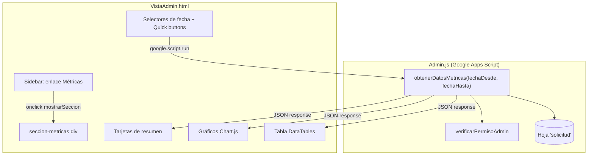

# Design Document: Admin Metrics Dashboard

## Overview

El Módulo de Métricas agrega una tercera sección ("Métricas") al panel de administración existente (VistaAdmin.html), proporcionando al coordinador visualizaciones de rendimiento del equipo de análisis. La implementación sigue la misma arquitectura cliente-servidor que las secciones existentes: una función de backend en Google Apps Script (Admin.js) que procesa datos de Google Sheets, y una sección frontend con gráficos Chart.js, tarjetas de resumen y una tabla DataTables.

### Decisiones de Diseño Clave

1. **Una sola función backend** (`obtenerDatosMetricas`): en vez de múltiples endpoints, se calcula todo en una sola llamada para minimizar latencia de `google.script.run` y el overhead de abrir el spreadsheet múltiples veces.
2. **Chart.js via CDN**: se agrega una sola referencia CDN (`chart.js@4`) sin registrar plugins adicionales, usando las capacidades built-in del chart para tooltips y responsividad.
3. **Procesamiento de fechas en backend**: la comparación de fechas se realiza en el servidor convirtiendo strings `dd/MM/yyyy` a timestamps numéricos, evitando problemas de timezone en el cliente.
4. **Integración no invasiva**: la nueva sección se agrega al HTML existente sin modificar las secciones Dashboard ni Usuarios; se extiende `mostrarSeccion()` con un caso adicional.

## Architecture



### Flujo de Datos

1. El coordinador hace clic en "Métricas" en el sidebar.
2. `mostrarSeccion('metricas')` muestra la sección y llama `cargarMetricas()`.
3. `cargarMetricas()` calcula las fechas del filtro activo y llama `google.script.run.obtenerDatosMetricas(fechaDesde, fechaHasta)`.
4. El backend lee la hoja `solicitud`, filtra por rango de fechas, agrega métricas y retorna un objeto consolidado.
5. El frontend recibe el objeto, actualiza tarjetas, redibuja gráficos y recarga la tabla.

## Components and Interfaces

### Backend: `obtenerDatosMetricas(fechaDesde, fechaHasta)`

**Ubicación:** `Admin.js`

**Parámetros:**
| Parámetro | Tipo | Formato | Descripción |
|-----------|------|---------|-------------|
| fechaDesde | string | "dd/MM/yyyy" | Fecha inicio del rango (inclusive) |
| fechaHasta | string | "dd/MM/yyyy" | Fecha fin del rango (inclusive) |

**Pseudocódigo:**

```javascript
function obtenerDatosMetricas(fechaDesde, fechaHasta) {
  verificarPermisoAdmin();
  
  const ss = SpreadsheetApp.openById(TARGET_SOLICITUDES_SS_ID);
  const hoja = ss.getSheetByName(SHEET_NAME_SOLICITUDES);
  const data = hoja.getDataRange().getDisplayValues();
  
  // Convertir strings de fecha a timestamps para comparación
  const desde = parseFechaDDMMYYYY(fechaDesde);
  const hasta = parseFechaDDMMYYYY(fechaHasta);
  
  // Iterar filas, filtrar por fecha_gestion (índice 33) dentro del rango
  // Agregar métricas: totales, promedios, agrupaciones por día y por analista
  
  return {
    totalGestionadas,
    tiempoPromedioMinutos,
    tasaAprobacion,
    fueraDeSLA,
    produccionDiaria: [{ fecha, cantidad }],
    distribucionEstados: { aprobadas, negadas, aplazadas },
    porAnalista: [{ nombre, total, aprobadas, negadas, aplazadas, tiempoPromedio, fueraSLA }],
    slaDiario: [{ fecha, dentroSLA, fueraSLA }]
  };
}
```

**Función auxiliar:**

```javascript
function parseFechaDDMMYYYY(fechaStr) {
  // Convierte "dd/MM/yyyy" a Date object para comparación numérica
  const partes = fechaStr.split('/');
  return new Date(parseInt(partes[2]), parseInt(partes[1]) - 1, parseInt(partes[0]));
}
```

**Lógica de clasificación SLA:**
- SLA cumplido: `SLA_Horas <= 4`
- SLA excedido: `SLA_Horas > 4`

### Frontend: Componentes UI

#### 1. Enlace de Navegación (Sidebar)

```html
<a href="#" id="link-metricas" class="nav-link-admin" onclick="mostrarSeccion('metricas', event)">
    <i class="bi bi-bar-chart-line-fill"></i> Métricas
</a>
```

#### 2. Sección Principal

```html
<div id="seccion-metricas" class="seccion-admin" style="display:none;">
  <!-- Título + botón actualizar -->
  <!-- Filtros de fecha -->
  <!-- Tarjetas de resumen (4 cards) -->
  <!-- Grid de gráficos (2x2) -->
  <!-- Tabla de rendimiento por analista -->
</div>
```

#### 3. Funciones JavaScript del Frontend

| Función | Responsabilidad |
|---------|----------------|
| `cargarMetricas()` | Obtiene fechas del filtro, muestra spinner, llama al backend |
| `renderizarMetricas(datos)` | Orquesta la actualización de tarjetas, gráficos y tabla |
| `actualizarTarjetas(datos)` | Actualiza los valores en las 4 tarjetas de resumen |
| `renderGraficoProduccion(produccionDiaria)` | Dibuja/actualiza gráfico de líneas |
| `renderGraficoEstados(distribucion)` | Dibuja/actualiza gráfico de dona |
| `renderGraficoAnalistas(porAnalista)` | Dibuja/actualiza gráfico de barras horizontales |
| `renderGraficoSLA(slaDiario)` | Dibuja/actualiza gráfico de barras agrupadas con línea 90% |
| `renderTablaAnalistas(porAnalista)` | Recrea DataTable con métricas individuales |
| `aplicarFiltroFechas()` | Valida rango, dispara `cargarMetricas()` |
| `setRangoRapido(tipo)` | Calcula fechas para "Hoy", "Última semana", "Último mes" |

### Extensión de `mostrarSeccion()`

```javascript
// Agregar al switch existente:
if (id === 'metricas') cargarMetricas();
```

### CDN de Chart.js

Agregar después de la línea de SweetAlert2:

```html
<script src="https://cdn.jsdelivr.net/npm/chart.js@4"></script>
```

## Data Models

### Objeto de Respuesta del Backend

```typescript
interface MetricasResponse {
  totalGestionadas: number;          // Conteo de solicitudes con fecha_gestion en rango
  tiempoPromedioMinutos: number;     // Promedio aritmético de Tiempo_Gestión (col 34)
  tasaAprobacion: number;            // (aprobadas / totalGestionadas) * 100, redondeado a 1 decimal
  fueraDeSLA: number;                // Conteo donde SLA_Horas > 4

  produccionDiaria: ProduccionDia[]; // Ordenado cronológicamente
  distribucionEstados: {
    aprobadas: number;
    negadas: number;
    aplazadas: number;
  };
  porAnalista: MetricaAnalista[];    // Ordenado por total desc
  slaDiario: SLADia[];              // Ordenado cronológicamente
}

interface ProduccionDia {
  fecha: string;    // "dd/MM/yyyy"
  cantidad: number;
}

interface MetricaAnalista {
  nombre: string;         // Nombre del analista (col 30)
  total: number;          // Total solicitudes gestionadas
  aprobadas: number;
  negadas: number;
  aplazadas: number;
  tiempoPromedio: number; // Promedio de Tiempo_Gestión en minutos
  fueraSLA: number;       // Conteo con SLA_Horas > 4
}

interface SLADia {
  fecha: string;     // "dd/MM/yyyy"
  dentroSLA: number; // Solicitudes con SLA_Horas <= 4
  fueraSLA: number;  // Solicitudes con SLA_Horas > 4
}
```

### Mapeo de Columnas de la Hoja "solicitud"

| Índice | Columna | Campo usado |
|--------|---------|-------------|
| 0 | A | ID solicitud |
| 16 | Q | estadoGeneral (APROBADA, NEGADA, APLAZADA) |
| 27 | AB | asignación (email analista) |
| 28 | AC | fecha fin gestión (datetime completo) |
| 29 | AD | SLA_Horas (número decimal) |
| 30 | AE | Nombre analista |
| 33 | AH | Fecha_Gestión (dd/MM/yyyy) - **campo principal de filtrado** |
| 34 | AI | Tiempo_Gestión (minutos) |

### Estado del Frontend (Variables Globales)

```javascript
let chartProduccion = null;   // Instancia Chart.js - líneas
let chartEstados = null;      // Instancia Chart.js - dona
let chartAnalistas = null;    // Instancia Chart.js - barras horizontales
let chartSLA = null;          // Instancia Chart.js - barras agrupadas
```

Se mantienen referencias a las instancias para llamar `.destroy()` antes de recrear, evitando memory leaks del canvas.


## Correctness Properties

*A property is a characteristic or behavior that should hold true across all valid executions of a system—essentially, a formal statement about what the system should do. Properties serve as the bridge between human-readable specifications and machine-verifiable correctness guarantees.*

### Property 1: Date Range Filtering

*For any* set of solicitudes with Fecha_Gestión values and *for any* valid date range [desde, hasta], the function `obtenerDatosMetricas` SHALL include only solicitudes whose Fecha_Gestión (dd/MM/yyyy parsed) falls within the inclusive range, and the `totalGestionadas` count SHALL equal the number of such solicitudes.

**Validates: Requirements 3.2, 9.3**

### Property 2: Arithmetic Mean Correctness

*For any* non-empty set of filtered solicitudes with numeric Tiempo_Gestión values, the `tiempoPromedioMinutos` SHALL equal the sum of all Tiempo_Gestión values divided by the count of solicitudes (standard arithmetic mean), rounded to one decimal place.

**Validates: Requirements 3.3, 7.5**

### Property 3: Estado Distribution Integrity

*For any* set of filtered solicitudes, the sum of `distribucionEstados.aprobadas + distribucionEstados.negadas + distribucionEstados.aplazadas` SHALL equal `totalGestionadas`, and `tasaAprobacion` SHALL equal `(distribucionEstados.aprobadas / totalGestionadas) * 100` rounded to one decimal place.

**Validates: Requirements 3.4, 5.2**

### Property 4: SLA Threshold Classification

*For any* solicitud with a numeric SLA_Horas value, it SHALL be classified as "dentro de SLA" if and only if SLA_Horas ≤ 4, and "fuera de SLA" if and only if SLA_Horas > 4. The global `fueraDeSLA` count SHALL equal the number of filtered solicitudes classified as "fuera de SLA".

**Validates: Requirements 3.5, 8.2**

### Property 5: Daily Production Grouping

*For any* set of filtered solicitudes, the `produccionDiaria` array SHALL contain one entry per distinct Fecha_Gestión, each entry's `cantidad` SHALL equal the count of solicitudes with that date, and the sum of all `cantidad` values SHALL equal `totalGestionadas`.

**Validates: Requirements 4.2**

### Property 6: Analyst Aggregation Completeness

*For any* set of filtered solicitudes, the `porAnalista` array SHALL contain one entry per distinct analyst name (column 30), and for each entry: `total` SHALL equal the count of that analyst's solicitudes, `aprobadas + negadas + aplazadas` SHALL equal `total`, and `tiempoPromedio` SHALL equal the arithmetic mean of that analyst's Tiempo_Gestión values.

**Validates: Requirements 6.2, 7.2**

### Property 7: Analyst Sort Invariant

*For any* `porAnalista` array with more than one element, for every consecutive pair of elements at positions i and i+1, `porAnalista[i].total` SHALL be greater than or equal to `porAnalista[i+1].total` (descending order).

**Validates: Requirements 6.3**

### Property 8: Response Structure Completeness

*For any* valid date range input, the returned object SHALL contain all required properties (`totalGestionadas`, `tiempoPromedioMinutos`, `tasaAprobacion`, `fueraDeSLA`, `produccionDiaria`, `distribucionEstados`, `porAnalista`, `slaDiario`) with their correct types (numbers, arrays of objects with specified keys).

**Validates: Requirements 9.4**

## Error Handling

### Backend Errors

| Escenario | Comportamiento |
|-----------|---------------|
| Usuario sin permisos ADMIN | `verificarPermisoAdmin()` lanza `Error("Acceso Denegado...")` antes de procesar datos |
| Hoja "solicitud" no encontrada | Lanzar `Error("No se pudo acceder a la hoja de solicitudes")` |
| Error de lectura de SpreadsheetApp | Capturar y relanzar con mensaje descriptivo: `Error("Error al leer datos: " + e.message)` |
| Fecha_Gestión con formato inválido | Ignorar la fila (no incluirla en cálculos); registrar warning en console |
| Tiempo_Gestión no numérico | Excluir del cálculo de promedio; no afectar conteo |
| SLA_Horas vacío o no numérico | No clasificar la solicitud como dentro/fuera de SLA |
| Rango sin datos | Retornar objeto con contadores en 0, arrays vacíos, tasaAprobacion en 0 |

### Frontend Errors

| Escenario | Comportamiento |
|-----------|---------------|
| Error del backend (withFailureHandler) | Ocultar spinner, mostrar `Swal.fire({icon:'error', title:'Error', text: err.message})` |
| Fecha desde > hasta | Mostrar `Swal.fire({icon:'warning', ...})` con mensaje de rango inválido; no llamar al backend |
| Chart.js no disponible (CDN fallo) | Mostrar mensaje en el contenedor del gráfico indicando que no se pudo cargar la librería |
| Datos vacíos para gráfico | Mostrar texto "Sin datos para el período seleccionado" centrado en el canvas container |

### Validación de Entrada (Frontend)

```javascript
function validarRangoFechas(desde, hasta) {
  if (!desde || !hasta) return { valido: false, mensaje: "Seleccione ambas fechas" };
  if (new Date(desde) > new Date(hasta)) return { valido: false, mensaje: "La fecha 'Desde' no puede ser posterior a 'Hasta'" };
  return { valido: true };
}
```

## Testing Strategy

### Enfoque Dual de Testing

Este feature combina lógica de agregación pura (backend) con renderizado UI (frontend). La estrategia se divide en:

#### Property-Based Tests (Backend Logic)

El backend `obtenerDatosMetricas` contiene lógica de agregación pura que es ideal para property-based testing:
- Filtrado por rango de fechas
- Cálculos aritméticos (promedios, porcentajes)
- Agrupaciones (por fecha, por analista, por estado)
- Clasificaciones (SLA threshold)
- Invariantes de ordenamiento

**Librería PBT:** [fast-check](https://github.com/dubzzz/fast-check) (JavaScript/TypeScript)

**Configuración:**
- Mínimo 100 iteraciones por property test
- Cada test referencia su property del diseño con tag: `Feature: admin-metrics-dashboard, Property {N}: {title}`

**Generators necesarios:**
- `arbitrarySolicitud()`: genera una solicitud con fecha aleatoria (dd/MM/yyyy), estado aleatorio (APROBADA|NEGADA|APLAZADA), tiempo gestión aleatorio (1-500 min), SLA horas aleatorio (0.5-12), nombre analista aleatorio
- `arbitraryDateRange()`: genera par de fechas [desde, hasta] donde desde ≤ hasta
- `arbitrarySolicitudSet(dateRange)`: genera array de solicitudes donde al menos algunas caen dentro del rango

**Nota sobre testabilidad:** Como el backend se ejecuta en Google Apps Script (no Node.js), los property tests se aplicarán a la **lógica de agregación extraída** en funciones puras separadas que el handler principal invoca. Esto permite testear las funciones de cálculo sin dependencia de SpreadsheetApp.

#### Unit Tests (Ejemplos y Edge Cases)

- Rango sin datos retorna objeto con valores 0
- Una sola solicitud retorna métricas correctas
- Fecha con formato inválido se ignora sin error
- Tiempo_Gestión no numérico se excluye del promedio
- SLA exactamente 4.0 se clasifica como "dentro de SLA"
- Analista sin nombre se agrupa como "Sin nombre"

#### Integration Tests (Frontend-Backend)

- Flujo completo: aplicar filtro → spinner → datos → gráficos renderizados
- Error de permisos muestra alerta correcta
- Botones de rango rápido calculan fechas correctas

#### UI Tests (Manual/Visual)

- Gráficos responsivos al redimensionar
- Tooltips muestran información correcta
- DataTables sorting y búsqueda funcional
- Celdas fuera de SLA resaltadas en rojo
- Sidebar navigation highlighting
