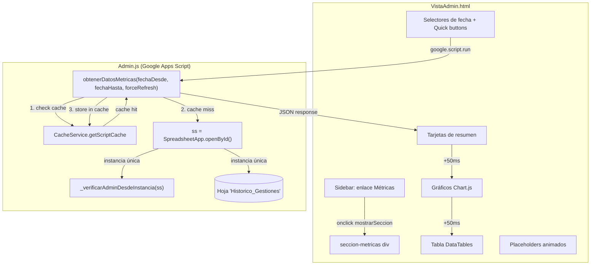
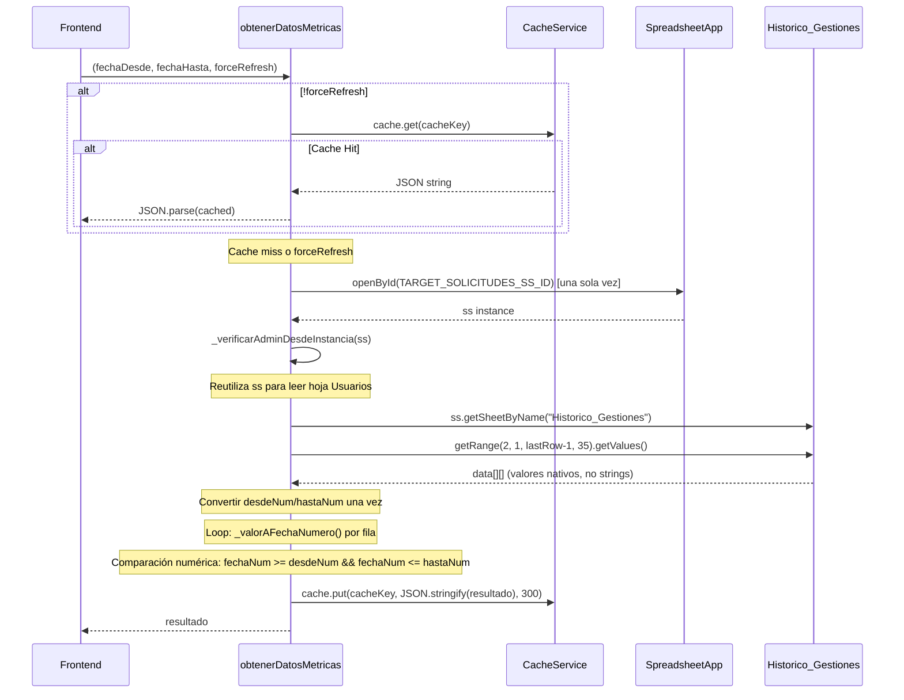

# Design Document: Admin Metrics Dashboard

## Overview

El Módulo de Métricas agrega una tercera sección ("Métricas") al panel de administración existente (VistaAdmin.html), proporcionando al coordinador visualizaciones de rendimiento del equipo de análisis. La implementación sigue la misma arquitectura cliente-servidor que las secciones existentes: una función de backend en Google Apps Script (Admin.js) que procesa datos de Google Sheets, y una sección frontend con gráficos Chart.js, tarjetas de resumen y una tabla DataTables.

### Decisiones de Diseño Clave

1. **Una sola función backend** (`obtenerDatosMetricas`): en vez de múltiples endpoints, se calcula todo en una sola llamada para minimizar latencia de `google.script.run` y el overhead de abrir el spreadsheet múltiples veces.
2. **Chart.js via CDN**: se agrega una sola referencia CDN (`chart.js@4`) sin registrar plugins adicionales, usando las capacidades built-in del chart para tooltips y responsividad.
3. **Procesamiento de fechas optimizado**: las fechas `dd/MM/yyyy` se convierten a enteros YYYYMMDD una sola vez antes del loop para comparación numérica rápida sin crear objetos Date por fila.
4. **Integración no invasiva**: la nueva sección se agrega al HTML existente sin modificar las secciones Dashboard ni Usuarios; se extiende `mostrarSeccion()` con un caso adicional.
5. **Instancia única de Spreadsheet**: se abre `SpreadsheetApp.openById()` una sola vez al inicio y se pasa la instancia a funciones auxiliares internas, evitando aperturas redundantes.
6. **Caché con CacheService**: los resultados se almacenan en `CacheService.getScriptCache()` con TTL de 5 minutos, usando una clave basada en el rango de fechas. El parámetro `forceRefresh` permite invalidar la caché desde el botón "Actualizar".
7. **Renderizado progresivo en frontend**: los componentes se renderizan secuencialmente (tarjetas → gráficos → tabla) con intervalos de 50ms y placeholders animados mientras se cargan.

## Architecture


```mermaid
flowchart TD
    subgraph Frontend ["VistaAdmin.html"]
        NAV[Sidebar: enlace Métricas]
        SEC[seccion-metricas div]
        FILTROS[Selectores de fecha + Quick buttons]
        CARDS[Tarjetas de resumen]
        CHARTS[Gráficos Chart.js]
        TABLE[Tabla DataTables]
        PLACEHOLDERS[Placeholders animados]
    end

    subgraph Backend ["Admin.js (Google Apps Script)"]
        FN["obtenerDatosMetricas(fechaDesde, fechaHasta, forceRefresh)"]
        CACHE[CacheService.getScriptCache]
        AUTH["_verificarAdminDesdeInstancia(ss)"]
        SS["ss = SpreadsheetApp.openById()"]
        SHEET[(Hoja 'Historico_Gestiones')]
    end

    NAV -->|onclick mostrarSeccion| SEC
    FILTROS -->|google.script.run| FN
    FN -->|1. check cache| CACHE
    CACHE -->|cache hit| FN
    FN -->|2. cache miss| SS
    SS -->|instancia única| AUTH
    SS -->|instancia única| SHEET
    FN -->|3. store in cache| CACHE
    FN -->|JSON response| CARDS
    CARDS -->|+50ms| CHARTS
    CHARTS -->|+50ms| TABLE
```

### Flujo de Datos

1. El coordinador hace clic en "Métricas" en el sidebar.
2. `mostrarSeccion('metricas')` muestra la sección y llama `cargarMetricas()`.
3. `cargarMetricas()` calcula las fechas del filtro activo y llama `google.script.run.obtenerDatosMetricas(fechaDesde, fechaHasta, forceRefresh)`.
4. El backend consulta CacheService:
   - **Cache hit**: retorna datos almacenados inmediatamente sin acceder a Sheets.
   - **Cache miss o forceRefresh**: abre spreadsheet una sola vez, verifica permisos con la misma instancia, lee datos con `getValues()`, procesa métricas, almacena en caché con TTL de 5 minutos, retorna resultado.
5. El frontend recibe el objeto y renderiza progresivamente: tarjetas primero, luego cada gráfico con intervalo de 50ms, mostrando placeholders animados mientras se carga cada componente.

## Components and Interfaces

### Backend: `obtenerDatosMetricas(fechaDesde, fechaHasta, forceRefresh)`

**Ubicación:** `Admin.js`

**Parámetros:**
| Parámetro | Tipo | Formato | Descripción |
|-----------|------|---------|-------------|
| fechaDesde | string | "dd/MM/yyyy" | Fecha inicio del rango (inclusive) |
| fechaHasta | string | "dd/MM/yyyy" | Fecha fin del rango (inclusive) |
| forceRefresh | boolean | true/false | Si true, ignora caché y recalcula desde Sheets |

**Pseudocódigo principal:**

```javascript
function obtenerDatosMetricas(fechaDesde, fechaHasta, forceRefresh) {
  // ═══ PASO 1: Verificar caché (Req 14) ═══
  const cache = CacheService.getScriptCache();
  const cacheKey = 'metricas_' + fechaDesde + '_' + fechaHasta;
  
  if (!forceRefresh) {
    const cached = cache.get(cacheKey);
    if (cached) return JSON.parse(cached);
  }
  
  // ═══ PASO 2: Abrir spreadsheet UNA sola vez (Req 12) ═══
  const ss = SpreadsheetApp.openById(TARGET_SOLICITUDES_SS_ID);
  
  // ═══ PASO 3: Verificar permisos reutilizando instancia (Req 12) ═══
  _verificarAdminDesdeInstancia(ss);
  
  // ═══ PASO 4: Leer datos con getValues() (Req 13) ═══
  const hoja = ss.getSheetByName("Historico_Gestiones");
  const lastRow = hoja.getLastRow();
  if (lastRow <= 1) return _resultadoVacio();
  
  // Leer rango completo con getValues() y extraer solo índices necesarios
  const data = hoja.getRange(2, 1, lastRow - 1, 35).getValues();
  // Índices usados: 0 (ID), 16 (estado), 27 (email), 28 (fechaFin),
  //                 29 (SLA_Horas), 30 (nombre), 33 (Fecha_Gestión), 34 (Tiempo_Gestión)
  
  // ═══ PASO 5: Convertir fechas límite a entero YYYYMMDD UNA vez (Req 16) ═══
  const desdeNum = _fechaDDMMYYYYaNumero(fechaDesde); // ej: "25/12/2024" → 20241225
  const hastaNum = _fechaDDMMYYYYaNumero(fechaHasta);
  
  // ═══ PASO 6: Iterar filas con comparación numérica optimizada ═══
  let totalGestionadas = 0;
  let sumaTiempo = 0, countTiempo = 0;
  let aprobadas = 0, negadas = 0, aplazadas = 0;
  let fueraDeSLA = 0;
  const porDia = {};       // { "dd/MM/yyyy": count }
  const slaPorDia = {};    // { "dd/MM/yyyy": { dentro: N, fuera: N } }
  const porAnalista = {};  // { nombre: { total, aprobadas, negadas, aplazadas, sumaTiempo, countTiempo, fueraSLA } }
  
  for (let i = 0; i < data.length; i++) {
    const fila = data[i];
    const fechaGestionRaw = fila[33];
    
    // Convertir Fecha_Gestión a entero numérico (Req 16)
    const fechaNum = _valorAFechaNumero(fechaGestionRaw);
    if (fechaNum === null) continue; // Fecha vacía o no parseable → skip
    
    // Comparación numérica rápida sin Date objects
    if (fechaNum < desdeNum || fechaNum > hastaNum) continue;
    
    // --- Fila dentro del rango: agregar métricas ---
    totalGestionadas++;
    
    const estado = String(fila[16] || "").toUpperCase().trim();
    if (estado === "APROBADA" || estado === "APROBADO") aprobadas++;
    else if (estado === "NEGADA" || estado === "NEGADO") negadas++;
    else if (estado === "APLAZADA" || estado === "APLAZADO") aplazadas++;
    
    const tiempoGestion = Number(fila[34]);
    if (!isNaN(tiempoGestion) && tiempoGestion > 0) {
      sumaTiempo += tiempoGestion;
      countTiempo++;
    }
    
    const slaHoras = Number(fila[29]);
    const fechaStr = _fechaNumeroAString(fechaNum); // Reconstruir "dd/MM/yyyy" para agrupación
    
    if (!isNaN(slaHoras)) {
      if (slaHoras > 4) fueraDeSLA++;
      if (!slaPorDia[fechaStr]) slaPorDia[fechaStr] = { dentro: 0, fuera: 0 };
      slaHoras <= 4 ? slaPorDia[fechaStr].dentro++ : slaPorDia[fechaStr].fuera++;
    }
    
    // Agrupación por día
    porDia[fechaStr] = (porDia[fechaStr] || 0) + 1;
    
    // Agrupación por analista
    const nombre = String(fila[30] || "").trim() || "Sin nombre";
    if (!porAnalista[nombre]) {
      porAnalista[nombre] = { total: 0, aprobadas: 0, negadas: 0, aplazadas: 0, sumaTiempo: 0, countTiempo: 0, fueraSLA: 0 };
    }
    porAnalista[nombre].total++;
    if (estado === "APROBADA" || estado === "APROBADO") porAnalista[nombre].aprobadas++;
    else if (estado === "NEGADA" || estado === "NEGADO") porAnalista[nombre].negadas++;
    else if (estado === "APLAZADA" || estado === "APLAZADO") porAnalista[nombre].aplazadas++;
    if (!isNaN(tiempoGestion) && tiempoGestion > 0) {
      porAnalista[nombre].sumaTiempo += tiempoGestion;
      porAnalista[nombre].countTiempo++;
    }
    if (!isNaN(slaHoras) && slaHoras > 4) porAnalista[nombre].fueraSLA++;
  }
  
  // ═══ PASO 7: Construir respuesta ═══
  const resultado = {
    totalGestionadas,
    tiempoPromedioMinutos: countTiempo > 0 ? Math.round((sumaTiempo / countTiempo) * 10) / 10 : 0,
    tasaAprobacion: totalGestionadas > 0 ? Math.round((aprobadas / totalGestionadas) * 1000) / 10 : 0,
    fueraDeSLA,
    produccionDiaria: _objectToSortedArray(porDia),
    distribucionEstados: { aprobadas, negadas, aplazadas },
    porAnalista: _buildAnalystArray(porAnalista),
    slaDiario: _buildSLAArray(slaPorDia)
  };
  
  // ═══ PASO 8: Almacenar en caché con TTL 5 minutos (Req 14) ═══
  try {
    cache.put(cacheKey, JSON.stringify(resultado), 300);
  } catch (e) {
    // Si el resultado excede 100KB del límite de CacheService, continuar sin caché
    Logger.log("Cache write failed (size limit): " + e.message);
  }
  
  return resultado;
}
```

**Funciones auxiliares internas:**

```javascript
/**
 * Verifica permisos ADMIN reutilizando una instancia ya abierta del spreadsheet (Req 12).
 * La función original verificarPermisoAdmin() NO se modifica (usada por 20+ funciones).
 * Esta variante interna acepta la instancia como parámetro.
 */
function _verificarAdminDesdeInstancia(ss) {
  const userEmail = Session.getActiveUser().getEmail().toLowerCase().trim();
  const hojaUser = ss.getSheetByName("Usuarios");
  const dataUser = hojaUser.getDataRange().getValues();
  const usuario = dataUser.find(f => String(f[2]).toLowerCase().trim() === userEmail);
  
  if (!usuario || String(usuario[23]).toUpperCase().trim() !== "ADMIN") {
    throw new Error("Acceso Denegado: Se requieren permisos de Administrador.");
  }
}

/**
 * Convierte string "dd/MM/yyyy" a entero YYYYMMDD para comparación numérica rápida (Req 16).
 * Ejemplo: "25/12/2024" → 20241225
 * Retorna null si el formato es inválido.
 */
function _fechaDDMMYYYYaNumero(fechaStr) {
  if (!fechaStr || typeof fechaStr !== 'string') return null;
  const partes = fechaStr.split('/');
  if (partes.length !== 3) return null;
  const dd = parseInt(partes[0], 10);
  const mm = parseInt(partes[1], 10);
  const yyyy = parseInt(partes[2], 10);
  if (isNaN(dd) || isNaN(mm) || isNaN(yyyy)) return null;
  return yyyy * 10000 + mm * 100 + dd;
}

/**
 * Convierte un valor de celda (puede ser Date object o string "dd/MM/yyyy") a entero YYYYMMDD (Req 16).
 * getValues() retorna Date objects para columnas con formato fecha, pero col 33 puede tener
 * strings dd/MM/yyyy si la hoja tiene formato de texto.
 */
function _valorAFechaNumero(valor) {
  if (!valor) return null;
  
  // Si es un Date object (getValues() lo retorna así para celdas con formato fecha)
  if (valor instanceof Date) {
    if (isNaN(valor.getTime())) return null;
    return valor.getFullYear() * 10000 + (valor.getMonth() + 1) * 100 + valor.getDate();
  }
  
  // Si es string "dd/MM/yyyy"
  return _fechaDDMMYYYYaNumero(String(valor));
}

/**
 * Reconstruye string "dd/MM/yyyy" desde entero YYYYMMDD para usar como clave de agrupación.
 */
function _fechaNumeroAString(num) {
  const yyyy = Math.floor(num / 10000);
  const mm = Math.floor((num % 10000) / 100);
  const dd = num % 100;
  return String(dd).padStart(2, '0') + '/' + String(mm).padStart(2, '0') + '/' + yyyy;
}

/**
 * Retorna objeto de métricas vacío para cuando no hay datos.
 */
function _resultadoVacio() {
  return {
    totalGestionadas: 0, tiempoPromedioMinutos: 0, tasaAprobacion: 0, fueraDeSLA: 0,
    produccionDiaria: [], distribucionEstados: { aprobadas: 0, negadas: 0, aplazadas: 0 },
    porAnalista: [], slaDiario: []
  };
}

/**
 * Convierte mapa de producción por día a array ordenado cronológicamente.
 */
function _objectToSortedArray(porDia) {
  return Object.keys(porDia)
    .map(fecha => ({ fecha, cantidad: porDia[fecha] }))
    .sort((a, b) => _fechaDDMMYYYYaNumero(a.fecha) - _fechaDDMMYYYYaNumero(b.fecha));
}

/**
 * Construye array de analistas ordenado por total descendente.
 */
function _buildAnalystArray(porAnalista) {
  return Object.keys(porAnalista)
    .map(nombre => ({
      nombre,
      total: porAnalista[nombre].total,
      aprobadas: porAnalista[nombre].aprobadas,
      negadas: porAnalista[nombre].negadas,
      aplazadas: porAnalista[nombre].aplazadas,
      tiempoPromedio: porAnalista[nombre].countTiempo > 0
        ? Math.round((porAnalista[nombre].sumaTiempo / porAnalista[nombre].countTiempo) * 10) / 10
        : 0,
      fueraSLA: porAnalista[nombre].fueraSLA
    }))
    .sort((a, b) => b.total - a.total);
}

/**
 * Construye array de SLA diario ordenado cronológicamente.
 */
function _buildSLAArray(slaPorDia) {
  return Object.keys(slaPorDia)
    .map(fecha => ({ fecha, dentroSLA: slaPorDia[fecha].dentro, fueraSLA: slaPorDia[fecha].fuera }))
    .sort((a, b) => _fechaDDMMYYYYaNumero(a.fecha) - _fechaDDMMYYYYaNumero(b.fecha));
}
```

**Lógica de clasificación SLA:**
- SLA cumplido: `SLA_Horas <= 4`
- SLA excedido: `SLA_Horas > 4`

### Secuencia completa del backend optimizado


```mermaid
sequenceDiagram
    participant Client as Frontend
    participant FN as obtenerDatosMetricas
    participant Cache as CacheService
    participant SS as SpreadsheetApp
    participant Sheet as Historico_Gestiones

    Client->>FN: (fechaDesde, fechaHasta, forceRefresh)
    
    alt !forceRefresh
        FN->>Cache: cache.get(cacheKey)
        alt Cache Hit
            Cache-->>FN: JSON string
            FN-->>Client: JSON.parse(cached)
        end
    end
    
    Note over FN: Cache miss o forceRefresh
    FN->>SS: openById(TARGET_SOLICITUDES_SS_ID) [una sola vez]
    SS-->>FN: ss instance
    
    FN->>FN: _verificarAdminDesdeInstancia(ss)
    Note over FN: Reutiliza ss para leer hoja Usuarios
    
    FN->>Sheet: ss.getSheetByName("Historico_Gestiones")
    FN->>Sheet: getRange(2, 1, lastRow-1, 35).getValues()
    Sheet-->>FN: data[][] (valores nativos, no strings)
    
    Note over FN: Convertir desdeNum/hastaNum una vez
    Note over FN: Loop: _valorAFechaNumero() por fila
    Note over FN: Comparación numérica: fechaNum >= desdeNum && fechaNum <= hastaNum
    
    FN->>Cache: cache.put(cacheKey, JSON.stringify(resultado), 300)
    FN-->>Client: resultado
```

### Frontend: Componentes UI

#### 1. Enlace de Navegación (Sidebar)

```html
<a href="#" id="link-metricas" class="nav-link-admin" onclick="mostrarSeccion('metricas', event)">
    <i class="bi bi-bar-chart-line-fill"></i> Métricas
</a>
```

#### 2. Sección Principal

```html
<div id="seccion-metricas" class="seccion-admin" style="display:none;">
  <!-- Título + botón actualizar (forceRefresh=true) -->
  <!-- Filtros de fecha -->
  <!-- Tarjetas de resumen (4 cards) -->
  <!-- Grid de gráficos (2x2) con placeholders animados -->
  <!-- Tabla de rendimiento por analista -->
</div>
```

#### 3. Placeholder de Carga para Gráficos (Req 15)

```html
<!-- Cada contenedor de gráfico incluye un placeholder que se remueve al renderizar -->
<div class="chart-container" id="container-produccion">
  <div class="chart-placeholder">
    <div class="placeholder-animation"></div>
    <span class="placeholder-text">Cargando gráfico...</span>
  </div>
  <canvas id="chart-produccion" style="display:none;"></canvas>
</div>
```

#### 4. Funciones JavaScript del Frontend (Renderizado Progresivo - Req 15)

| Función | Responsabilidad |
|---------|----------------|
| `cargarMetricas(forceRefresh)` | Obtiene fechas del filtro, muestra placeholders, llama al backend con parámetro forceRefresh |
| `renderizarMetricas(datos)` | Orquesta renderizado progresivo: tarjetas → gráficos (50ms intervalo) → tabla |
| `actualizarTarjetas(datos)` | Actualiza los valores en las 4 tarjetas de resumen (se renderiza primero) |
| `renderGraficoProduccion(produccionDiaria)` | Dibuja gráfico de líneas, remueve placeholder |
| `renderGraficoEstados(distribucion)` | Dibuja gráfico de dona, remueve placeholder |
| `renderGraficoAnalistas(porAnalista)` | Dibuja gráfico de barras horizontales, remueve placeholder |
| `renderGraficoSLA(slaDiario)` | Dibuja gráfico de barras agrupadas con línea 90%, remueve placeholder |
| `renderTablaAnalistas(porAnalista)` | Recrea DataTable con métricas individuales |
| `mostrarPlaceholders()` | Muestra animación de carga en todos los contenedores de gráfico |
| `aplicarFiltroFechas()` | Valida rango, dispara `cargarMetricas(false)` |
| `setRangoRapido(tipo)` | Calcula fechas para "Hoy", "Última semana", "Último mes" |

**Pseudocódigo del renderizado progresivo:**

```javascript
function cargarMetricas(forceRefresh = false) {
  const { desde, hasta } = obtenerFechasFiltro();
  const validacion = validarRangoFechas(desde, hasta);
  if (!validacion.valido) {
    Swal.fire({ icon: 'warning', text: validacion.mensaje });
    return;
  }
  
  // Mostrar placeholders animados en cada contenedor de gráfico
  mostrarPlaceholders();
  
  google.script.run
    .withSuccessHandler(renderizarMetricas)
    .withFailureHandler(err => {
      ocultarPlaceholders();
      Swal.fire({ icon: 'error', title: 'Error', text: err.message });
    })
    .obtenerDatosMetricas(desde, hasta, forceRefresh);
}

function renderizarMetricas(datos) {
  // Paso 1: Renderizar tarjetas inmediatamente (Req 15.1)
  actualizarTarjetas(datos);
  
  // Paso 2: Renderizar gráficos secuencialmente con 50ms de intervalo (Req 15.1, 15.3)
  const renderQueue = [
    () => renderGraficoProduccion(datos.produccionDiaria),
    () => renderGraficoEstados(datos.distribucionEstados),
    () => renderGraficoAnalistas(datos.porAnalista),
    () => renderGraficoSLA(datos.slaDiario),
    () => renderTablaAnalistas(datos.porAnalista)
  ];
  
  renderQueue.forEach((renderFn, index) => {
    setTimeout(renderFn, (index + 1) * 50);
  });
}

function mostrarPlaceholders() {
  document.querySelectorAll('.chart-placeholder').forEach(el => el.style.display = 'flex');
  document.querySelectorAll('.chart-container canvas').forEach(el => el.style.display = 'none');
}

// Cada función render* sigue este patrón:
function renderGraficoProduccion(produccionDiaria) {
  const container = document.getElementById('container-produccion');
  container.querySelector('.chart-placeholder').style.display = 'none';
  const canvas = container.querySelector('canvas');
  canvas.style.display = 'block';
  
  if (chartProduccion) chartProduccion.destroy();
  chartProduccion = new Chart(canvas, { /* config */ });
}
```

**Botón Actualizar (force refresh - Req 14.4):**

```javascript
// El botón "Actualizar" pasa forceRefresh=true para invalidar caché
document.getElementById('btn-actualizar-metricas').onclick = () => cargarMetricas(true);
```

### Extensión de `mostrarSeccion()`

```javascript
// Agregar al switch existente:
if (id === 'metricas') cargarMetricas();
```

### CDN de Chart.js

Agregar después de la línea de SweetAlert2:

```html
<script src="https://cdn.jsdelivr.net/npm/chart.js@4"></script>
```

## Data Models

### Objeto de Respuesta del Backend

```typescript
interface MetricasResponse {
  totalGestionadas: number;          // Conteo de solicitudes con fecha_gestion en rango
  tiempoPromedioMinutos: number;     // Promedio aritmético de Tiempo_Gestión (col 34)
  tasaAprobacion: number;            // (aprobadas / totalGestionadas) * 100, redondeado a 1 decimal
  fueraDeSLA: number;                // Conteo donde SLA_Horas > 4

  produccionDiaria: ProduccionDia[]; // Ordenado cronológicamente
  distribucionEstados: {
    aprobadas: number;
    negadas: number;
    aplazadas: number;
  };
  porAnalista: MetricaAnalista[];    // Ordenado por total desc
  slaDiario: SLADia[];              // Ordenado cronológicamente
}

interface ProduccionDia {
  fecha: string;    // "dd/MM/yyyy"
  cantidad: number;
}

interface MetricaAnalista {
  nombre: string;         // Nombre del analista (col 30)
  total: number;          // Total solicitudes gestionadas
  aprobadas: number;
  negadas: number;
  aplazadas: number;
  tiempoPromedio: number; // Promedio de Tiempo_Gestión en minutos
  fueraSLA: number;       // Conteo con SLA_Horas > 4
}

interface SLADia {
  fecha: string;     // "dd/MM/yyyy"
  dentroSLA: number; // Solicitudes con SLA_Horas <= 4
  fueraSLA: number;  // Solicitudes con SLA_Horas > 4
}
```

### Estructura de Caché (Req 14)

| Aspecto | Detalle |
|---------|---------|
| Servicio | `CacheService.getScriptCache()` (compartido entre usuarios del mismo deployment) |
| Clave | `"metricas_" + fechaDesde + "_" + fechaHasta` (ej: `"metricas_01/01/2025_31/01/2025"`) |
| Valor | `JSON.stringify(MetricasResponse)` |
| TTL | 300 segundos (5 minutos) |
| Límite de tamaño | 100KB por valor (límite de CacheService) |
| Invalidación | Parámetro `forceRefresh=true` desde botón "Actualizar" |

**Nota:** Si el resultado serializado excede 100KB (posible con rangos de fechas muy amplios con muchos analistas), el sistema continúa sin caché y registra un log informativo. No se lanza error al usuario.

### Mapeo de Columnas de la Hoja "Historico_Gestiones" (ssReestudios)

Columnas leídas de la hoja Historico_Gestiones del spreadsheet de Reestudios/UAR:

| Índice | Columna | Campo usado |
|--------|---------|-------------|
| 1 | B | ID solicitud (reestudio) |
| 6 | G | Email analista |
| 7 | H | Nombre analista |
| 9 | J | Fecha fin gestión |
| 10 | K | Estado final |
| 14 | O | Tiempo total resolución (horas) |
| 15 | P | Tiempo gestión (minutos) |
| 18 | S | Tipo de proceso |

### Mapeo de Columnas de la Hoja "Historico_Gestiones" (ssSolicitudes)

Columnas usadas por `obtenerDatosMetricas` (se lee rango completo con `getValues()` pero solo se acceden estos índices):

| Índice | Columna | Campo usado | Tipo de valor con getValues() |
|--------|---------|-------------|-------------------------------|
| 0 | A | ID solicitud | String |
| 16 | Q | estadoGeneral (APROBADA, NEGADA, APLAZADA) | String |
| 27 | AB | asignación (email analista) | String |
| 28 | AC | fecha fin gestión (datetime completo) | Date object |
| 29 | AD | SLA_Horas (número decimal) | Number |
| 30 | AE | Nombre analista | String |
| 33 | AH | Fecha_Gestión (dd/MM/yyyy) - **campo principal de filtrado** | Date object o String |
| 34 | AI | Tiempo_Gestión (minutos) | Number |

**Nota sobre `getValues()` vs `getDisplayValues()` (Req 13):** Al usar `getValues()`, las celdas con formato de fecha retornan objetos `Date` nativos de JavaScript en lugar de strings formateados. La función `_valorAFechaNumero()` maneja ambos casos (Date object y string "dd/MM/yyyy") para robustez.

### Estado del Frontend (Variables Globales)

```javascript
let chartProduccion = null;   // Instancia Chart.js - líneas
let chartEstados = null;      // Instancia Chart.js - dona
let chartAnalistas = null;    // Instancia Chart.js - barras horizontales
let chartSLA = null;          // Instancia Chart.js - barras agrupadas
```

Se mantienen referencias a las instancias para llamar `.destroy()` antes de recrear, evitando memory leaks del canvas.


## Correctness Properties

*A property is a characteristic or behavior that should hold true across all valid executions of a system—essentially, a formal statement about what the system should do. Properties serve as the bridge between human-readable specifications and machine-verifiable correctness guarantees.*

### Property 1: Date Range Filtering

*For any* set of solicitudes with Fecha_Gestión values and *for any* valid date range [desde, hasta], the function `obtenerDatosMetricas` SHALL include only solicitudes whose Fecha_Gestión (dd/MM/yyyy parsed) falls within the inclusive range, and the `totalGestionadas` count SHALL equal the number of such solicitudes.

**Validates: Requirements 3.2, 9.3**

### Property 2: Arithmetic Mean Correctness

*For any* non-empty set of filtered solicitudes with numeric Tiempo_Gestión values, the `tiempoPromedioMinutos` SHALL equal the sum of all Tiempo_Gestión values divided by the count of solicitudes (standard arithmetic mean), rounded to one decimal place.

**Validates: Requirements 3.3, 7.5**

### Property 3: Estado Distribution Integrity

*For any* set of filtered solicitudes, the sum of `distribucionEstados.aprobadas + distribucionEstados.negadas + distribucionEstados.aplazadas` SHALL equal `totalGestionadas`, and `tasaAprobacion` SHALL equal `(distribucionEstados.aprobadas / totalGestionadas) * 100` rounded to one decimal place.

**Validates: Requirements 3.4, 5.2**

### Property 4: SLA Threshold Classification

*For any* solicitud with a numeric SLA_Horas value, it SHALL be classified as "dentro de SLA" if and only if SLA_Horas ≤ 4, and "fuera de SLA" if and only if SLA_Horas > 4. The global `fueraDeSLA` count SHALL equal the number of filtered solicitudes classified as "fuera de SLA".

**Validates: Requirements 3.5, 8.2**

### Property 5: Daily Production Grouping

*For any* set of filtered solicitudes, the `produccionDiaria` array SHALL contain one entry per distinct Fecha_Gestión, each entry's `cantidad` SHALL equal the count of solicitudes with that date, and the sum of all `cantidad` values SHALL equal `totalGestionadas`.

**Validates: Requirements 4.2**

### Property 6: Analyst Aggregation Completeness

*For any* set of filtered solicitudes, the `porAnalista` array SHALL contain one entry per distinct analyst name (column 30), and for each entry: `total` SHALL equal the count of that analyst's solicitudes, `aprobadas + negadas + aplazadas` SHALL equal `total`, and `tiempoPromedio` SHALL equal the arithmetic mean of that analyst's Tiempo_Gestión values.

**Validates: Requirements 6.2, 7.2**

### Property 7: Analyst Sort Invariant

*For any* `porAnalista` array with more than one element, for every consecutive pair of elements at positions i and i+1, `porAnalista[i].total` SHALL be greater than or equal to `porAnalista[i+1].total` (descending order).

**Validates: Requirements 6.3**

### Property 8: Response Structure Completeness

*For any* valid date range input, the returned object SHALL contain all required properties (`totalGestionadas`, `tiempoPromedioMinutos`, `tasaAprobacion`, `fueraDeSLA`, `produccionDiaria`, `distribucionEstados`, `porAnalista`, `slaDiario`) with their correct types (numbers, arrays of objects with specified keys).

**Validates: Requirements 9.4**

### Property 9: Date Numeric Conversion Equivalence

*For any* valid date string in "dd/MM/yyyy" format, converting it to integer YYYYMMDD via `_fechaDDMMYYYYaNumero` and comparing numerically SHALL produce the same ordering as comparing the corresponding Date objects chronologically. Specifically, for dates A and B: `_fechaDDMMYYYYaNumero(A) < _fechaDDMMYYYYaNumero(B)` if and only if A is chronologically before B.

**Validates: Requirements 16.1, 16.2**

### Property 10: Cache Consistency

*For any* date range [desde, hasta], when `forceRefresh` is false and a cache entry exists for that range, the function SHALL return a result identical to what would be computed from the spreadsheet data (assuming no concurrent writes). When `forceRefresh` is true, the function SHALL always read from the spreadsheet regardless of cache state.

**Validates: Requirements 14.1, 14.2, 14.4**

### Property 11: Single Spreadsheet Instance

*For any* invocation of `obtenerDatosMetricas` that results in a cache miss, `SpreadsheetApp.openById()` SHALL be called exactly once, and both the permission verification and data reads SHALL use that same instance.

**Validates: Requirements 12.1, 12.2, 12.3**

## Error Handling

### Backend Errors

| Escenario | Comportamiento |
|-----------|---------------|
| Usuario sin permisos ADMIN | `_verificarAdminDesdeInstancia(ss)` lanza `Error("Acceso Denegado...")` antes de procesar datos |
| Hoja "Historico_Gestiones" no encontrada | Lanzar `Error("No se pudo acceder a la hoja de gestiones")` |
| Error de lectura de SpreadsheetApp | Capturar y relanzar con mensaje descriptivo: `Error("Error al leer datos: " + e.message)` |
| Fecha_Gestión con formato inválido / Date inválida | `_valorAFechaNumero()` retorna null → fila se ignora (no incluirla en cálculos) |
| Tiempo_Gestión no numérico | Excluir del cálculo de promedio; no afectar conteo |
| SLA_Horas vacío o no numérico | No clasificar la solicitud como dentro/fuera de SLA |
| Rango sin datos | Retornar `_resultadoVacio()` con contadores en 0, arrays vacíos |
| Cache write falla (límite 100KB) | Log informativo, continuar sin caché; no afecta respuesta al usuario |
| Cache read falla | Continuar como cache miss; no afecta funcionalidad |

### Frontend Errors

| Escenario | Comportamiento |
|-----------|---------------|
| Error del backend (withFailureHandler) | Ocultar placeholders, mostrar `Swal.fire({icon:'error', title:'Error', text: err.message})` |
| Fecha desde > hasta | Mostrar `Swal.fire({icon:'warning', ...})` con mensaje de rango inválido; no llamar al backend |
| Chart.js no disponible (CDN fallo) | Mostrar mensaje en el contenedor del gráfico indicando que no se pudo cargar la librería |
| Datos vacíos para gráfico | Mostrar texto "Sin datos para el período seleccionado" centrado en el canvas container |
| Error en un gráfico individual | El error no bloquea los demás: cada setTimeout es independiente; se muestra error en ese contenedor |

### Validación de Entrada (Frontend)

```javascript
function validarRangoFechas(desde, hasta) {
  if (!desde || !hasta) return { valido: false, mensaje: "Seleccione ambas fechas" };
  if (new Date(desde) > new Date(hasta)) return { valido: false, mensaje: "La fecha 'Desde' no puede ser posterior a 'Hasta'" };
  return { valido: true };
}
```

## Testing Strategy

### Enfoque Dual de Testing

Este feature combina lógica de agregación pura (backend) con renderizado UI (frontend). La estrategia se divide en:

#### Property-Based Tests (Backend Logic)

El backend `obtenerDatosMetricas` contiene lógica de agregación pura que es ideal para property-based testing:
- Filtrado por rango de fechas (comparación numérica YYYYMMDD)
- Cálculos aritméticos (promedios, porcentajes)
- Agrupaciones (por fecha, por analista, por estado)
- Clasificaciones (SLA threshold)
- Invariantes de ordenamiento
- Equivalencia de conversión de fechas (Date ↔ entero YYYYMMDD)
- Consistencia de caché (idempotencia de resultados)

**Librería PBT:** [fast-check](https://github.com/dubzzz/fast-check) (JavaScript/TypeScript)

**Configuración:**
- Mínimo 100 iteraciones por property test
- Cada test referencia su property del diseño con tag: `Feature: admin-metrics-dashboard, Property {N}: {title}`

**Generators necesarios:**
- `arbitrarySolicitud()`: genera una solicitud con fecha aleatoria (dd/MM/yyyy), estado aleatorio (APROBADA|NEGADA|APLAZADA), tiempo gestión aleatorio (1-500 min), SLA horas aleatorio (0.5-12), nombre analista aleatorio
- `arbitraryDateRange()`: genera par de fechas [desde, hasta] donde desde ≤ hasta
- `arbitrarySolicitudSet(dateRange)`: genera array de solicitudes donde al menos algunas caen dentro del rango
- `arbitraryDateString()`: genera string dd/MM/yyyy válida para testear `_fechaDDMMYYYYaNumero`
- `arbitraryDateObject()`: genera Date object válida para testear `_valorAFechaNumero`

**Nota sobre testabilidad:** Como el backend se ejecuta en Google Apps Script (no Node.js), los property tests se aplicarán a la **lógica de agregación extraída** en funciones puras separadas que el handler principal invoca. Esto permite testear las funciones de cálculo sin dependencia de SpreadsheetApp.

#### Unit Tests (Ejemplos y Edge Cases)

- Rango sin datos retorna `_resultadoVacio()`
- Una sola solicitud retorna métricas correctas
- Fecha_Gestión como Date object se convierte correctamente a entero YYYYMMDD
- Fecha_Gestión como string "dd/MM/yyyy" se convierte correctamente a entero YYYYMMDD
- Fecha con formato inválido (`_valorAFechaNumero` retorna null) se ignora sin error
- Tiempo_Gestión no numérico se excluye del promedio
- SLA exactamente 4.0 se clasifica como "dentro de SLA"
- Analista sin nombre se agrupa como "Sin nombre"
- `_fechaDDMMYYYYaNumero("25/12/2024")` retorna `20241225`
- `_fechaDDMMYYYYaNumero("01/01/2000")` retorna `20000101`
- `_fechaDDMMYYYYaNumero(null)` retorna `null`
- `_fechaDDMMYYYYaNumero("invalid")` retorna `null`
- Cache hit retorna mismo resultado que cálculo directo
- forceRefresh=true siempre recalcula ignorando caché

#### Integration Tests (Frontend-Backend)

- Flujo completo: aplicar filtro → placeholders → datos → gráficos renderizados progresivamente
- Error de permisos muestra alerta correcta
- Botones de rango rápido calculan fechas correctas
- Botón "Actualizar" envía forceRefresh=true
- Renderizado progresivo: tarjetas aparecen primero, gráficos después con 50ms intervalo

#### UI Tests (Manual/Visual)

- Gráficos responsivos al redimensionar
- Tooltips muestran información correcta
- DataTables sorting y búsqueda funcional
- Celdas fuera de SLA resaltadas en rojo
- Sidebar navigation highlighting
- Placeholders animados visibles durante carga de gráficos
- Transición suave de placeholder a gráfico renderizado

## Performance Considerations

### Optimizaciones Implementadas (Requisitos 12-16)

| Optimización | Impacto Estimado | Requisito |
|---|---|---|
| Instancia única de Spreadsheet | Elimina ~1-2s de overhead por `openById()` redundante | Req 12 |
| `getValues()` en lugar de `getDisplayValues()` | ~20-30% más rápido en lecturas grandes (no requiere formateo a string) | Req 13 |
| CacheService con TTL 5 min | Consultas repetidas: ~50ms vs ~3-8s | Req 14 |
| Renderizado progresivo con 50ms interval | Tiempo percibido de carga reducido (tarjetas visibles inmediatamente) | Req 15 |
| Comparación de fechas como enteros YYYYMMDD | Elimina ~N creaciones de `new Date()` en el loop (N = total filas de Historico_Gestiones) | Req 16 |

### Análisis de Complejidad

- **Sin caché (cache miss):** O(N) donde N = filas totales de Historico_Gestiones. Una sola pasada por los datos.
- **Con caché (cache hit):** O(1) — lectura y deserialización del JSON almacenado.
- **Espacio de caché:** O(A + D) donde A = analistas distintos, D = días distintos en el rango.

### Limitaciones Conocidas de Google Apps Script

| Limitación | Mitigación |
|---|---|
| `CacheService` máximo 100KB por valor | try/catch en cache.put; si falla, continuar sin caché |
| `CacheService` máximo 6h TTL | Usamos 5 min que es suficiente para navegación entre secciones |
| GAS no permite lectura de columnas no contiguas | Se lee rango completo (cols 1-35) y se acceden solo los 8 índices necesarios |
| Ejecución máxima 6 minutos por invocación | Con Historico_Gestiones de hasta ~50K filas, el loop simple toma <5s |
| No hay workers/threads en GAS | Todo el procesamiento es secuencial; el caché mitiga repeticiones |

### Estrategia de Crecimiento de Datos

La hoja Historico_Gestiones crece diariamente (~20-50 filas/día). Con el enfoque actual:
- **Hoy:** ~5K-10K filas → tiempo de procesamiento ~1-3s
- **1 año:** ~15K-25K filas → tiempo de procesamiento ~3-5s
- **2+ años:** Si supera 50K filas, considerar migrar a lectura por rango de filas o particionar la hoja por período.

El caché de 5 minutos absorbe la mayoría de consultas repetidas durante una sesión de trabajo del coordinador.
