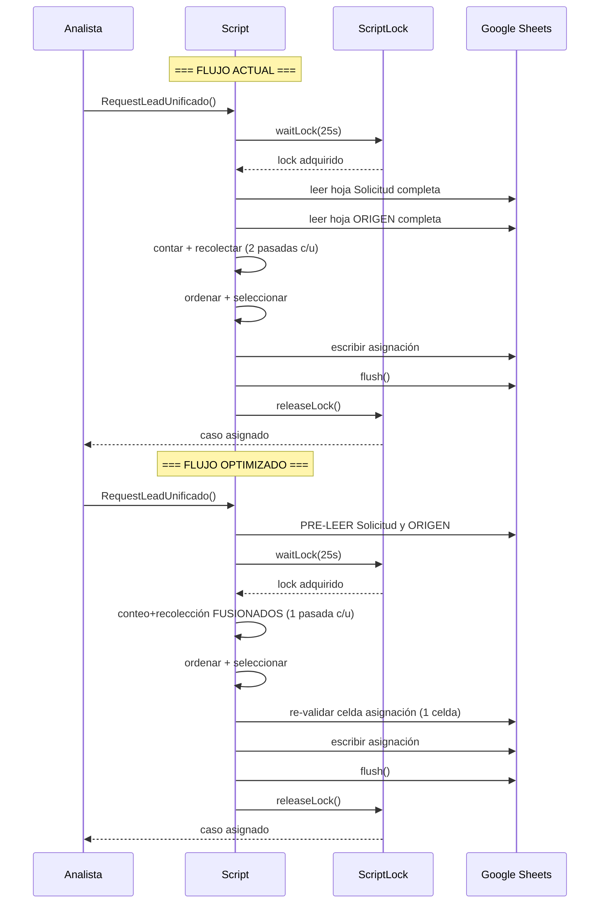
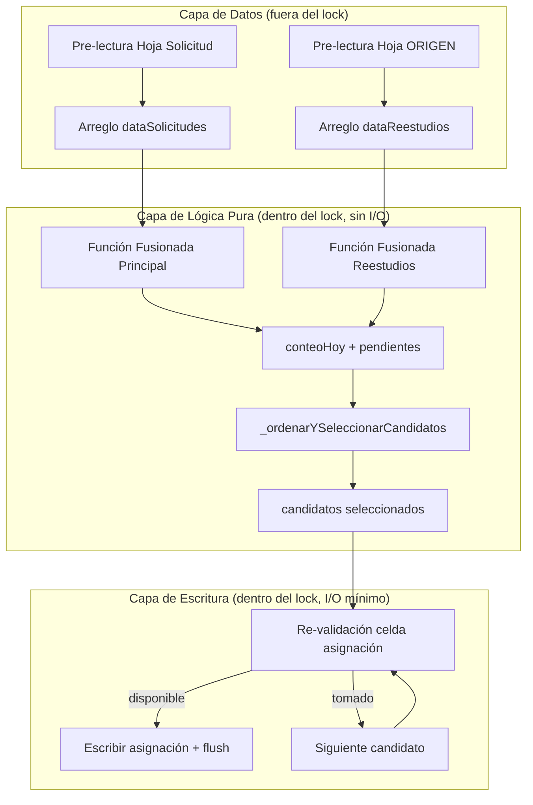
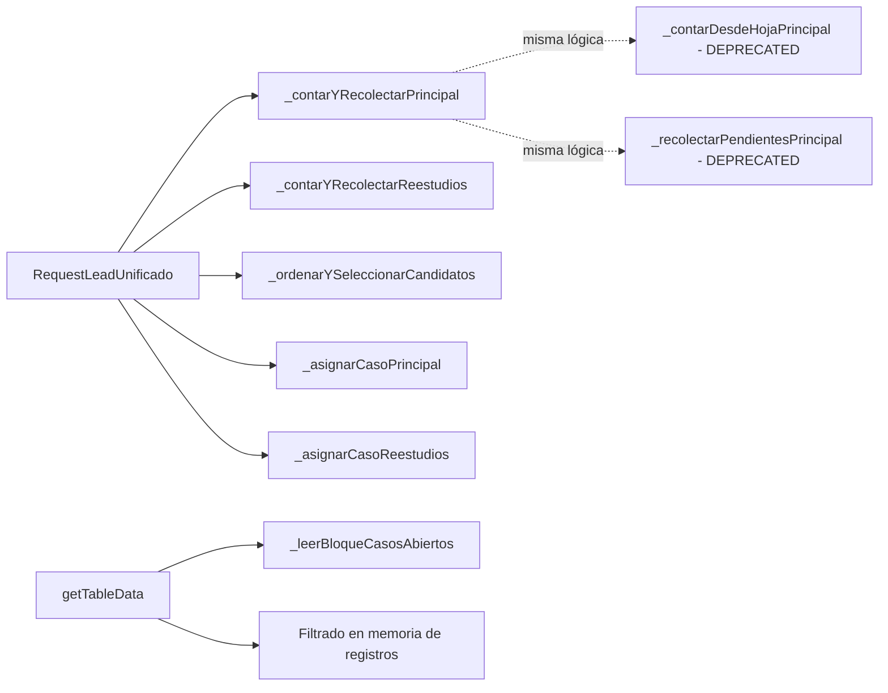

# Design Document: Latency Optimization Engine

## Overview

Este diseño aborda la reducción de latencia en el motor de asignación de casos (`RequestLeadUnificado`) y las funciones de carga de panel del analista (`getTableData`, `cargarPanelAnalista`). El sistema actual ejecuta lecturas de hojas completas, iteraciones duplicadas y viajes de red redundantes **dentro** del ScriptLock global, lo que genera contención innecesaria entre analistas concurrentes.

La estrategia de optimización se basa en 5 técnicas complementarias:

1. **Fusión de funciones** — eliminar iteraciones duplicadas sobre el mismo arreglo
2. **Pre-lectura fuera del lock** — mover lecturas de red antes de adquirir el candado
3. **Filtrado en memoria** — sustituir `createTextFinder` cuando los datos ya están en una variable
4. **Lectura por bloque** — un solo `getRange` en vez de N individuales
5. **Re-validación ligera** — confirmar disponibilidad con una lectura mínima de 1 celda

Todas las optimizaciones preservan la garantía de exclusividad: un caso se asigna a exactamente un analista.

### Diagrama de flujo actual vs. optimizado



## Architecture

### High-Level Design (HLD)

La arquitectura de optimización se organiza en 3 capas:



**Principios arquitectónicos:**

| Principio | Implementación |
|-----------|---------------|
| Sección crítica mínima | Solo re-validación + escritura dentro del lock |
| Sin I/O de lectura masiva en lock | Lecturas completas ANTES de `waitLock()` |
| Lógica pura testeable | Funciones fusionadas son funciones puras (array in → results out) |
| Compatibilidad hacia atrás | Mismos resultados, misma interfaz externa |

### Low-Level Design (LLD)

#### Módulo 1: Funciones Fusionadas

```javascript
// ANTES: 2 funciones × 2 hojas = 4 iteraciones
_contarDesdeHojaPrincipal(userEmail, ss, ctx);       // iteración 1
_recolectarPendientesPrincipal(data, cuotas, ...);   // iteración 2

// DESPUÉS: 1 función × 2 hojas = 2 iteraciones
_contarYRecolectarPrincipal(dataSolicitudes, userEmail, ctx, cuotas, equipo);
// Retorna: { conteoHoy, cargaPendiente, pendientes }
```

#### Módulo 2: Pre-lectura y Re-validación

```javascript
// Pre-lectura FUERA del lock
var dataSolicitudes = hojaSolicitud.getRange(...).getValues();
var dataReestudios = hojaOrigen.getRange(...).getValues();

// Lock
lock.waitLock(25000);

// Re-validación DENTRO del lock (1 celda por candidato seleccionado)
var celdaAsignado = hoja.getRange(lead.rowIndex, COL_ASIGNADO).getValue();
if (celdaAsignado !== "") {
  // caso ya tomado → siguiente candidato
  continue;
}
// escribir asignación...
```

#### Módulo 3: Filtrado en Memoria para getTableData

```javascript
// ANTES: createTextFinder sobre la hoja (viaje de red)
var matches = colAsignado.createTextFinder(userEmail).findAll();

// DESPUÉS: filtro sobre el arreglo ya cargado
var misFilas = registros.filter(function(row) {
  return String(row[COL_ASIGNADO]).trim().toLowerCase() === userEmail;
});
```

#### Módulo 4: Lectura por Bloque para Historico_Gestiones

```javascript
// ANTES: N lecturas individuales
filasAbiertas.forEach(function(fila) {
  var datos = hoja.getRange(fila, 1, 1, cols).getValues()[0]; // N viajes
});

// DESPUÉS: 1 lectura de bloque + filtro en memoria
var filaMin = Math.min(...filasAbiertas);
var filaMax = Math.max(...filasAbiertas);
var bloque = hoja.getRange(filaMin, 1, filaMax - filaMin + 1, cols).getValues();
var datos = filasAbiertas.map(function(fila) {
  return bloque[fila - filaMin];
});
```

## Components and Interfaces

### Componentes modificados

| Componente | Archivo | Cambio |
|-----------|---------|--------|
| `_contarYRecolectarPrincipal` | MotorAsignacion.js | **NUEVO** — fusión de `_contarDesdeHojaPrincipal` + `_recolectarPendientesPrincipal` |
| `_contarYRecolectarReestudios` | MotorAsignacion.js | **NUEVO** — fusión de `_contarDesdeHojaReestudios` + `_recolectarPendientesReestudios` |
| `RequestLeadUnificado` | MotorAsignacion.js | **MODIFICADO** — pre-lectura fuera del lock + re-validación + invocación de funciones fusionadas |
| `getTableData` | Código.js | **MODIFICADO** — filtrado en memoria de `solicitud` y `ORIGEN` + lectura por bloque en Historico_Gestiones |
| `_leerBloqueCasosAbiertos` | Código.js | **NUEVO** — utilidad para lectura por bloque |

### Interfaces

```javascript
/**
 * Fusión de conteo + recolección para hoja principal.
 * FUNCIÓN PURA: no realiza I/O, opera solo sobre el arreglo recibido.
 *
 * @param {Array<Array>} dataSolicitudes - Datos completos de la hoja (con header en [0])
 * @param {string} userEmail - Email del analista normalizado
 * @param {Object} ctx - Contexto de fecha (de _buildFechaHoyFormats)
 * @param {Object} cuotas - Cupos efectivos del analista
 * @param {Object} equipo - Configuración del equipo (canonDesde, canonHasta, canonTipos)
 * @returns {{ conteoHoy: Object, cargaPendiente: number, pendientes: Array }}
 */
function _contarYRecolectarPrincipal(dataSolicitudes, userEmail, ctx, cuotas, equipo) { }

/**
 * Fusión de conteo + recolección para hoja ORIGEN.
 * FUNCIÓN PURA: no realiza I/O, opera solo sobre el arreglo recibido.
 *
 * @param {Array<Array>} dataReestudios - Datos completos de ORIGEN (con header en [0])
 * @param {string} userEmail - Email del analista normalizado
 * @param {Object} ctx - Contexto de fecha
 * @param {Object} cuotas - Cupos efectivos
 * @returns {{ conteoHoy: Object, cargaPendiente: number, pendientes: Array }}
 */
function _contarYRecolectarReestudios(dataReestudios, userEmail, ctx, cuotas) { }

/**
 * Lee un bloque contiguo [minRow:maxRow] y devuelve solo las filas cuyos
 * índices están en `filasDeseadas`.
 *
 * @param {Sheet} hoja - Referencia a la hoja de Sheets
 * @param {Array<number>} filasDeseadas - Números de fila (1-indexed) a extraer
 * @param {number} numCols - Cantidad de columnas a leer
 * @returns {Array<Array>} Datos de las filas solicitadas, en el mismo orden que filasDeseadas
 */
function _leerBloqueCasosAbiertos(hoja, filasDeseadas, numCols) { }
```

### Diagrama de dependencias



## Data Models

### Estructura de retorno de funciones fusionadas

```javascript
// _contarYRecolectarPrincipal retorna:
{
  conteoHoy: {
    digital: number,
    desaplazamiento: number,
    induccion: number,
    reestudio: number,
    nuevaUar: number,
    deudorUar: number,
    biometriaFallida: number
  },
  cargaPendiente: number,  // casos asignados sin fechaFin
  pendientes: [
    {
      base: 'PRINCIPAL',
      rowIndex: number,      // fila real en la hoja (para re-validación)
      rowData: Array,        // fila completa
      tipo: string,          // 'digital' | 'desaplazamiento' | 'induccion'
      reasignada: boolean,
      esExterno: boolean,
      polizaKey: string,
      fechaOrd: number       // timestamp para ordenamiento
    }
  ]
}

// _contarYRecolectarReestudios retorna el mismo shape con:
// pendientes[].base = 'REESTUDIOS'
// pendientes[].tipo = 'reestudio' | 'nuevaUar' | 'deudorUar' | 'biometriaFallida'
```

### Estado del flujo de RequestLeadUnificado optimizado

```javascript
// Fase 1: Pre-lectura (SIN lock)
{
  dataSolicitudes: Array<Array>,  // hoja "solicitud" completa
  dataReestudios: Array<Array>,   // hoja "ORIGEN" completa
  dataUsuarios: Array<Array>,     // de _getDataUsuarios() (cacheado)
}

// Fase 2: Procesamiento (CON lock, sin I/O)
{
  conteoHoyTotal: Object,       // suma de conteo en-hoja + contadores incrementales
  capPendienteReal: number,     // suma carga en-hoja + contadores incrementales
  pendientes: Array,            // candidatos fusionados de ambas hojas
  seleccionados: Array,         // candidatos elegidos por _ordenarYSeleccionarCandidatos
}

// Fase 3: Escritura (CON lock, I/O mínimo)
{
  // Por cada seleccionado:
  revalidacionOk: boolean,      // celda de asignación sigue vacía
  // Si ok → escribir + registrar contador
  // Si no ok → siguiente candidato
}
```

## Correctness Properties

*A property is a characteristic or behavior that should hold true across all valid executions of a system — essentially, a formal statement about what the system should do. Properties serve as the bridge between human-readable specifications and machine-verifiable correctness guarantees.*

### Property 1: Equivalencia de la función fusionada principal

*For any* arreglo de datos de la Hoja_Solicitud, cualquier email de analista, cualquier contexto de fecha, y cualquier configuración de cupos/equipo, la función fusionada `_contarYRecolectarPrincipal` SHALL producir un `conteoHoy` idéntico al de `_contarDesdeHojaPrincipal` ejecutada sobre los mismos datos, Y una lista de `pendientes` con el mismo contenido y orden que `_recolectarPendientesPrincipal` ejecutada de forma independiente.

**Validates: Requirements 1.1, 1.2, 1.3**

### Property 2: Equivalencia de la función fusionada de reestudios

*For any* arreglo de datos de la Hoja_ORIGEN, cualquier email de analista, cualquier contexto de fecha, y cualquier configuración de cupos, la función fusionada `_contarYRecolectarReestudios` SHALL producir un `conteoHoy` idéntico al de `_contarDesdeHojaReestudios` Y una lista de `pendientes` con el mismo contenido y orden que `_recolectarPendientesReestudios`.

**Validates: Requirements 2.1, 2.2, 2.3**

### Property 3: Re-validación descarta candidatos stale

*For any* lista de N candidatos seleccionados y cualquier subconjunto K de ellos que haya sido asignado a otro analista entre la pre-lectura y la adquisición del lock, el motor SHALL asignar exactamente el primer candidato no-stale de la lista (posición K+1) si existe, o reportar "sin casos disponibles" si K = N.

**Validates: Requirements 3.3, 3.4, 6.3**

### Property 4: Exclusividad de asignación bajo concurrencia

*For any* conjunto de M ejecuciones concurrentes de `RequestLeadUnificado` que compiten por los mismos N casos, cada caso SHALL ser asignado a exactamente un analista (0 duplicados), independientemente del orden de interleaving entre las ejecuciones.

**Validates: Requirements 3.5, 6.2**

### Property 5: Equivalencia de filtrado en memoria vs. TextFinder

*For any* arreglo de datos de una hoja y cualquier email de analista, el filtrado en memoria (recorrido + comparación de la columna de asignado) SHALL producir el mismo conjunto de índices de fila que `createTextFinder(email).matchEntireCell(true).findAll()` habría retornado.

**Validates: Requirements 4.4**

### Property 6: Equivalencia de lectura por bloque

*For any* conjunto de N números de fila deseados dentro de un rango [minRow, maxRow], la lectura de un solo bloque `getRange(minRow, 1, maxRow-minRow+1, cols)` seguida de filtrado en memoria SHALL producir el mismo conjunto de datos que N lecturas individuales `getRange(fila_i, 1, 1, cols)`.

**Validates: Requirements 5.2, 5.3**

### Property 7: Preservación de totales con contadores incrementales

*For any* resultado de conteo en-hoja (`conteoHoy` de la función fusionada) y cualquier estado de los contadores incrementales (`_obtenerConteoHoyAnalista`), el total combinado SHALL ser la suma elemento-a-elemento de ambos objetos, sin omitir ni duplicar ningún tipo de caso.

**Validates: Requirements 7.1**

## Error Handling

| Escenario | Comportamiento | Impacto |
|-----------|---------------|---------|
| Pre-lectura falla (hoja no existe) | Retornar `{ success: false, message }` antes de intentar lock | Ninguno — mismo comportamiento actual |
| Lock no disponible tras 25s | Retornar mensaje de "sistema ocupado" | Sin cambio |
| Re-validación encuentra caso tomado | Descartar candidato, intentar siguiente | Transparente para el analista |
| Todos los candidatos son stale | Retornar "sin casos disponibles" | El analista reintenta |
| Error en escritura de asignación | Propagar excepción, `finally` libera lock | Sin cambio — flush no ocurrió, dato no persistido |
| Contadores incrementales desincronizados | `admin_recalcularContadores()` los reconstruye | Sin cambio — compatible con optimizaciones |
| `_leerBloqueCasosAbiertos` recibe lista vacía | Retornar `[]` sin hacer getRange | Sin efecto |

### Manejo de condiciones de carrera

La condición de carrera principal es: dos analistas leen el mismo caso como "disponible" fuera del lock, ambos entran al lock secuencialmente, y ambos intentan asignárselo.

**Mitigación:** Re-validación de celda. El segundo analista en adquirir el lock lee la celda de asignación del caso, ve que ya no está vacía, descarta el candidato, y toma el siguiente de su lista pre-calculada — todo sin liberar el lock.

## Testing Strategy

### Enfoque dual: Unit Tests + Property-Based Tests

| Tipo | Librería | Cobertura |
|------|----------|-----------|
| Property-Based Tests | [fast-check](https://github.com/dubzzz/fast-check) | Properties 1–7 (lógica pura de fusión, filtrado, bloques, concurrencia) |
| Unit Tests (ejemplo) | Jasmine (estándar GAS) o clasp + Jest | Integración con mocks de SpreadsheetApp, orden de llamadas, edge cases |
| Benchmark Tests | Custom timing harness | Verificación del 30% de mejora (Req 1.4, 2.4) |

### Property-Based Testing

**Configuración:**
- Librería: `fast-check` (JavaScript, compatible con el entorno de pruebas vía clasp + Node)
- Mínimo 100 iteraciones por propiedad
- Cada test referencia su propiedad del diseño con un tag

**Estrategia de generadores:**

```javascript
// Generador de fila de Hoja_Solicitud (59 columnas)
const solicitudRowArb = fc.tuple(
  fc.string(),                    // [0] solicitud ID
  fc.string(),                    // [1] póliza
  // ... columnas intermedias
  fc.oneof(fc.constant(''), fc.constant('EN_ESTUDIO'), fc.constant('APROBADO_PENDIENTE_BIOMETRIA')),  // [16] estado
  fc.oneof(fc.constant(''), fc.date().map(d => d.toISOString())),  // [17] fechaRadicacion
  // [26] fechaAsignacion, [27] asignado (email o vacío), [28] fechaFin
  fc.oneof(fc.constant(''), fc.emailAddress()),  // asignado
  // ...
);

// Generador de fila de Hoja_ORIGEN (14 columnas)
const origenRowArb = fc.tuple(
  fc.date().map(d => formatDate(d)),  // [0] fechaRadicacion
  fc.string(),                         // [1] solicitud
  // [6] asignado, [8] fechaAsig, [9] fechaFin
  // ...
);
```

**Tags de propiedades:**

```javascript
// Feature: latency-optimization-engine, Property 1: Equivalencia de la función fusionada principal
it('fused principal function produces identical results to sequential', () => {
  fc.assert(fc.property(solicitudDataArb, emailArb, ctxArb, cuotasArb, equipoArb,
    (data, email, ctx, cuotas, equipo) => {
      const fused = _contarYRecolectarPrincipal(data, email, ctx, cuotas, equipo);
      const conteo = _contarDesdeHojaPrincipal_ref(data, email, ctx);
      const pendientes = _recolectarPendientesPrincipal_ref(data, cuotas, conteo.conteoHoy, equipo);
      expect(fused.conteoHoy).toEqual(conteo.conteoHoy);
      expect(fused.pendientes).toEqual(pendientes);
    }
  ), { numRuns: 200 });
});
```

### Unit Tests (ejemplo)

- Verificar que `RequestLeadUnificado` no invoca `getRange` sobre hojas completas después de `waitLock()`
- Verificar que `flush()` se llama antes de `releaseLock()`
- Verificar que contadores incrementales se actualizan correctamente tras asignación
- Verificar que `guardarCambiosInternos`, `guardarGestionBiometria` y `guardarGestionReestudio` no adquieren ScriptLock
- Verificar que `createTextFinder` NO se invoca sobre `solicitud`/`ORIGEN` cuando los datos ya están en memoria

### Benchmark Tests

- Comparar tiempo de `_contarDesdeHojaPrincipal` + `_recolectarPendientesPrincipal` vs. `_contarYRecolectarPrincipal` con datos sintéticos de 500-2000 filas
- Verificar umbral de mejora ≥30%
- Medir reducción de tiempo total dentro del lock con el flujo optimizado completo

### Ejecución

Los property tests se ejecutan fuera de Google Apps Script (vía clasp + Node.js + Jest/Vitest) extrayendo las funciones puras a módulos testables. Las funciones fusionadas son **funciones puras** (no dependen de SpreadsheetApp) y se pueden probar directamente con `fast-check`.

```bash
# Ejecución de property tests
npx vitest --run tests/properties/
```
