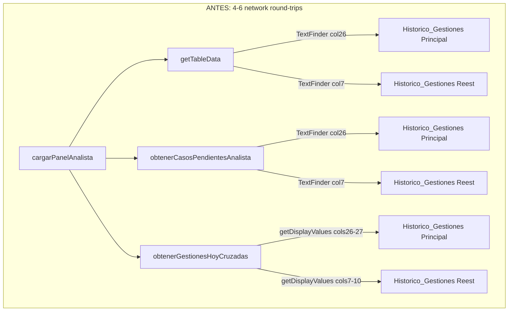
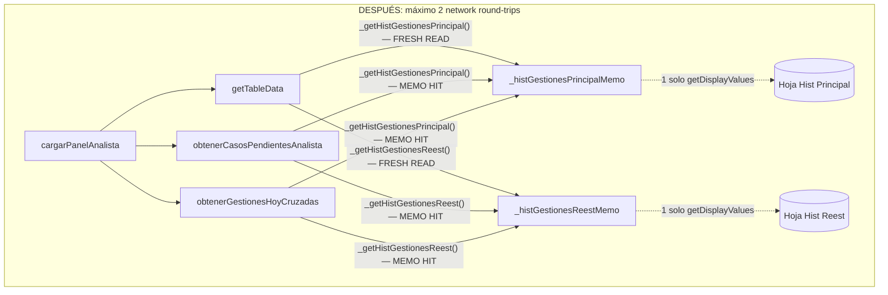
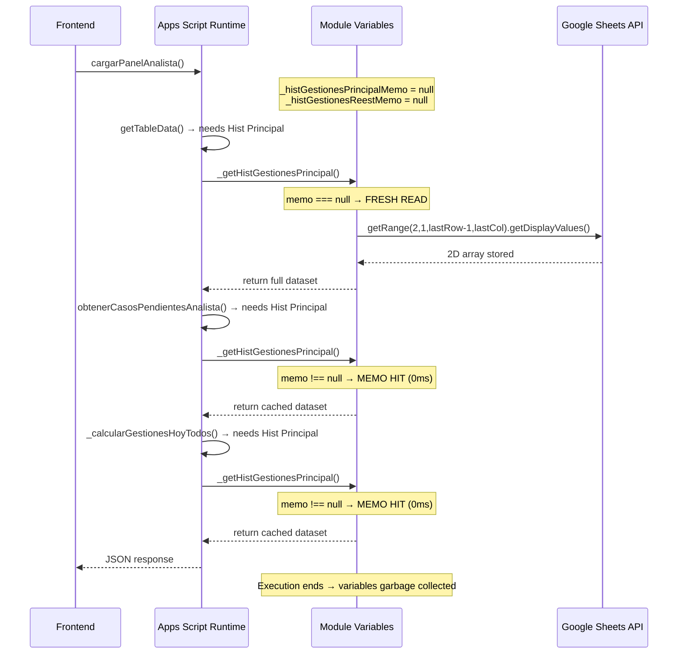
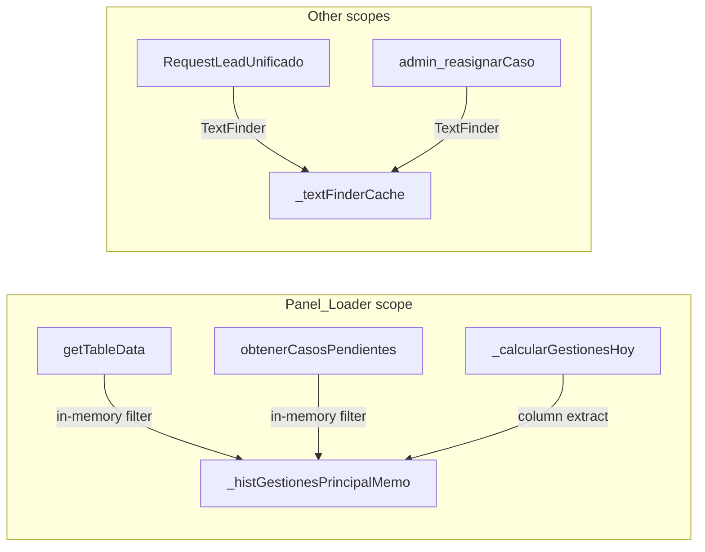
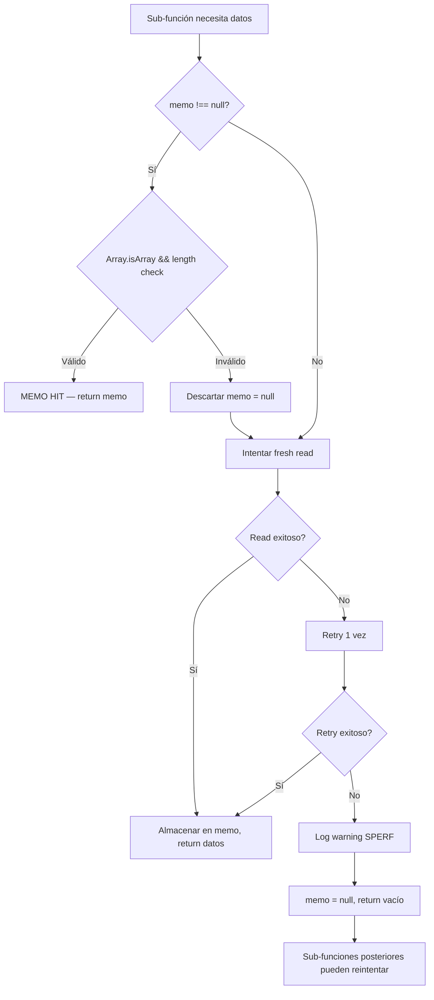

# Design Document: Panel Load Deduplication

## Overview

Esta optimización elimina lecturas redundantes de las hojas `Historico_Gestiones` (principal y reestudios) dentro de una misma ejecución de `cargarPanelAnalista()`. El patrón es idéntico al ya existente (`_datosTurnosMemo`, `_datosUsuariosMemo`, `_scoreMapMemo`): variables de módulo que se inicializan en `null`, se llenan en la primera lectura, y devuelven los datos cacheados en lecturas posteriores — reseteándose automáticamente entre ejecuciones de Apps Script.

### Problema Actual

`cargarPanelAnalista()` orquesta:
1. `getUnifiedTableData()` → `getTableData()` → usa `_filasFiltradasPorAnalista` (TextFinder + lectura individual de filas en Historico_Gestiones principal y reestudios)
2. `obtenerCasosPendientesAnalista()` → TextFinder en Historico_Gestiones principal (col 26) y reestudios (col 7)
3. `obtenerGestionesHoyCruzadas()` → `_calcularGestionesHoyTodos()` → `getDisplayValues` completo de cols 26-27 (principal) y cols 7-10 (reestudios)

Cada sub-función hace su propia lectura de red, pagando ~800-1200ms por hoja. Con 2 hojas × 2-3 lecturas = 4-6 round-trips redundantes (~3-5 segundos desperdiciados).

### Solución

Dos variables de módulo (`_histGestionesPrincipalMemo` y `_histGestionesReestMemo`) que almacenan el dataset COMPLETO (todas las filas, todas las columnas) en la primera lectura. Las sub-funciones extraen su subconjunto de columnas en memoria (~0ms) en vez de hacer round-trips de red.

## Architecture

### Data Flow (Before vs After)





### Execution Scope Lifecycle



## Components and Interfaces

### Module-Level Variable Declarations

```javascript
// ============================================================
// MEMOIZACIÓN DE HISTORICO_GESTIONES (por ejecución)
// ============================================================
// Mismo patrón que _datosTurnosMemo y _datosUsuariosMemo: se llena en la
// primera lectura dentro de cargarPanelAnalista() y se reutiliza por todas
// las sub-funciones que necesitan datos de Historico_Gestiones. Se resetea
// automáticamente al finalizar la ejecución del servidor.

/** @type {Array<Array<string>>|null} Todas las filas (row 2..lastRow) × todas las columnas de Historico_Gestiones principal */
var _histGestionesPrincipalMemo = null;

/** @type {Array<Array<string>>|null} Todas las filas (row 2..lastRow) × todas las columnas de Historico_Gestiones reestudios */
var _histGestionesReestMemo = null;
```

### Accessor Functions (Getter Pattern)

```javascript
/**
 * Obtiene los datos de Historico_Gestiones del spreadsheet principal.
 * Primera llamada: lee toda la hoja (row 2 .. lastRow, col 1 .. lastCol) con getDisplayValues().
 * Llamadas posteriores: devuelve el memo sin network round-trip.
 *
 * @returns {Array<Array<string>>} 2D array con todas las filas (sin header) y columnas, o [] si falla.
 */
function _getHistGestionesPrincipal() {
  if (_histGestionesPrincipalMemo !== null) {
    // Validar integridad del memo
    if (!Array.isArray(_histGestionesPrincipalMemo)) {
      Logger.log('⏱ SPERF _getHistGestionesPrincipal: memo inválido (no es Array) — descartando');
      _histGestionesPrincipalMemo = null;
    } else {
      Logger.log('⏱ SPERF _getHistGestionesPrincipal: memo hit (' + _histGestionesPrincipalMemo.length + ' filas)');
      return _histGestionesPrincipalMemo;
    }
  }

  // Fresh read
  var _t0 = Date.now();
  try {
    var hoja = _abrirSSCacheado(TARGET_SOLICITUDES_SS_ID).getSheetByName("Historico_Gestiones");
    if (!hoja || hoja.getLastRow() < 2) {
      _histGestionesPrincipalMemo = [];
      Logger.log('⏱ SPERF _getHistGestionesPrincipal: hoja vacía o no encontrada — memo = []');
      return _histGestionesPrincipalMemo;
    }
    var lastRow = hoja.getLastRow();
    var lastCol = Math.max(hoja.getLastColumn(), 61); // mínimo 61 cols para cubrir todos los consumidores
    _histGestionesPrincipalMemo = hoja.getRange(2, 1, lastRow - 1, lastCol).getDisplayValues();
    Logger.log('⏱ SPERF _getHistGestionesPrincipal: fresh read = ' + (Date.now() - _t0) + 'ms (' + _histGestionesPrincipalMemo.length + ' filas × ' + lastCol + ' cols)');
  } catch (e) {
    // Retry una vez
    Logger.log('⏱ SPERF _getHistGestionesPrincipal: primer intento falló (' + e.message + ') — reintentando');
    try {
      var hoja2 = _abrirSSCacheado(TARGET_SOLICITUDES_SS_ID).getSheetByName("Historico_Gestiones");
      if (hoja2 && hoja2.getLastRow() >= 2) {
        var lastRow2 = hoja2.getLastRow();
        var lastCol2 = Math.max(hoja2.getLastColumn(), 61);
        _histGestionesPrincipalMemo = hoja2.getRange(2, 1, lastRow2 - 1, lastCol2).getDisplayValues();
        Logger.log('⏱ SPERF _getHistGestionesPrincipal: retry OK = ' + (Date.now() - _t0) + 'ms');
      } else {
        _histGestionesPrincipalMemo = [];
      }
    } catch (e2) {
      Logger.log('⏱ SPERF _getHistGestionesPrincipal: retry TAMBIÉN falló (' + e2.message + ') — devolviendo []');
      _histGestionesPrincipalMemo = null; // dejar null para que otro sub-function pueda reintentar
      return [];
    }
  }
  return _histGestionesPrincipalMemo || [];
}
```

```javascript
/**
 * Obtiene los datos de Historico_Gestiones del spreadsheet de reestudios.
 * Primera llamada: lee toda la hoja (row 2 .. lastRow, col 1 .. lastCol) con getDisplayValues().
 * Llamadas posteriores: devuelve el memo sin network round-trip.
 *
 * @returns {Array<Array<string>>} 2D array con todas las filas (sin header) y columnas, o [] si falla.
 */
function _getHistGestionesReest() {
  if (_histGestionesReestMemo !== null) {
    if (!Array.isArray(_histGestionesReestMemo)) {
      Logger.log('⏱ SPERF _getHistGestionesReest: memo inválido (no es Array) — descartando');
      _histGestionesReestMemo = null;
    } else {
      Logger.log('⏱ SPERF _getHistGestionesReest: memo hit (' + _histGestionesReestMemo.length + ' filas)');
      return _histGestionesReestMemo;
    }
  }

  var _t0 = Date.now();
  try {
    var hoja = _abrirSSCacheado(ID_HOJA_REESTUDIOS).getSheetByName("Historico_Gestiones");
    if (!hoja || hoja.getLastRow() < 2) {
      _histGestionesReestMemo = [];
      Logger.log('⏱ SPERF _getHistGestionesReest: hoja vacía o no encontrada — memo = []');
      return _histGestionesReestMemo;
    }
    var lastRow = hoja.getLastRow();
    var lastCol = Math.max(hoja.getLastColumn(), 14); // mínimo 14 cols
    _histGestionesReestMemo = hoja.getRange(2, 1, lastRow - 1, lastCol).getDisplayValues();
    Logger.log('⏱ SPERF _getHistGestionesReest: fresh read = ' + (Date.now() - _t0) + 'ms (' + _histGestionesReestMemo.length + ' filas × ' + lastCol + ' cols)');
  } catch (e) {
    Logger.log('⏱ SPERF _getHistGestionesReest: primer intento falló (' + e.message + ') — reintentando');
    try {
      var hoja2 = _abrirSSCacheado(ID_HOJA_REESTUDIOS).getSheetByName("Historico_Gestiones");
      if (hoja2 && hoja2.getLastRow() >= 2) {
        var lastRow2 = hoja2.getLastRow();
        var lastCol2 = Math.max(hoja2.getLastColumn(), 14);
        _histGestionesReestMemo = hoja2.getRange(2, 1, lastRow2 - 1, lastCol2).getDisplayValues();
        Logger.log('⏱ SPERF _getHistGestionesReest: retry OK = ' + (Date.now() - _t0) + 'ms');
      } else {
        _histGestionesReestMemo = [];
      }
    } catch (e2) {
      Logger.log('⏱ SPERF _getHistGestionesReest: retry TAMBIÉN falló (' + e2.message + ') — devolviendo []');
      _histGestionesReestMemo = null;
      return [];
    }
  }
  return _histGestionesReestMemo || [];
}
```

### Invalidation Functions

```javascript
/** Invalida el memo de Historico_Gestiones principal. Mismo patrón que _invalidarCacheTurnos(). */
function _invalidarMemoHistPrincipal() {
  _histGestionesPrincipalMemo = null;
}

/** Invalida el memo de Historico_Gestiones reestudios. */
function _invalidarMemoHistReest() {
  _histGestionesReestMemo = null;
}

/** Invalida ambos memos de Historico_Gestiones. */
function _invalidarMemoHistGestiones() {
  _histGestionesPrincipalMemo = null;
  _histGestionesReestMemo = null;
}
```

### Integration Points — Sub-Function Changes

#### 1. `getTableData()` — Bloque "Historico_Gestiones principal"

**Antes:** TextFinder en columna 26 + lecturas individuales de filas  
**Después:** Usa `_getHistGestionesPrincipal()` y filtra en memoria

```javascript
// ANTES (dentro de getTableData):
const filasMatch = _getFilasAnalista(hojaHist, 26, userEmail);
// ... lecturas individuales por fila

// DESPUÉS:
const dataHist = _getHistGestionesPrincipal();
// Filtrar en memoria: buscar email en columna 25 (0-indexed para col 26)
const filasMatch = [];
for (var i = 0; i < dataHist.length; i++) {
  if (String(dataHist[i][25]).trim().toLowerCase() === userEmail) {
    filasMatch.push({ idx: i, valores: dataHist[i] });
  }
}
```

#### 2. `getTableData()` — Bloque "Historico_Gestiones reestudios"

**Antes:** TextFinder en columna 7 + lecturas individuales  
**Después:** Usa `_getHistGestionesReest()` y filtra en memoria

```javascript
// DESPUÉS:
const dataHistReest = _getHistGestionesReest();
for (var i = 0; i < dataHistReest.length; i++) {
  if (String(dataHistReest[i][6]).trim().toLowerCase() === userEmail) {
    // procesar fila in-memory
  }
}
```

#### 3. `obtenerCasosPendientesAnalista()` — Bloque digital

**Antes:** TextFinder en col 26, luego `_filasFiltradasPorAnalista`  
**Después:** Filtra `_getHistGestionesPrincipal()` en memoria por col 26 (idx 25) + predicado en col 17 (idx 16)

```javascript
// DESPUÉS:
const dataHist = _getHistGestionesPrincipal();
const filasCandidatas = [];
for (var i = 0; i < dataHist.length; i++) {
  var asignado = String(dataHist[i][25]).trim().toLowerCase();
  var estadoQ = String(dataHist[i][16]).trim().toUpperCase();
  if (asignado === userEmail && ESTADOS_PEND.includes(estadoQ)) {
    filasCandidatas.push({ fila: i + 2, valores: dataHist[i] });
  }
}
```

#### 4. `obtenerCasosPendientesAnalista()` — Bloque reestudios

**Antes:** TextFinder en col 7, luego `_filasFiltradasPorAnalista`  
**Después:** Filtra `_getHistGestionesReest()` en memoria por col 7 (idx 6) + predicado en col 11 (idx 10)

```javascript
// DESPUÉS:
const dataReest = _getHistGestionesReest();
const filasCandidatasR = [];
for (var i = 0; i < dataReest.length; i++) {
  var asignado = String(dataReest[i][6]).trim().toLowerCase();
  var estadoQ = String(dataReest[i][10]).trim().toUpperCase();
  if (asignado === userEmail && ESTADOS_PEND.includes(estadoQ)) {
    filasCandidatasR.push({ fila: i + 2, valores: dataReest[i] });
  }
}
```

#### 5. `_calcularGestionesHoyTodos()` — Bloque principal

**Antes:** `hojaHistG.getRange(2, 26, lastRow-1, 2).getDisplayValues()`  
**Después:** Extrae cols 26-27 (idx 25-26) del memo

```javascript
// DESPUÉS:
const dataHistG = _getHistGestionesPrincipal();
// Iterar y extraer cols 25-26 en memoria
for (var i = 0; i < dataHistG.length; i++) {
  var asignado = String(dataHistG[i][25]).trim().toLowerCase(); // col 26
  var fechaFin = String(dataHistG[i][26]).trim();               // col 27
  if (fechaFin.includes(hoyStr)) sumar(asignado, 'digital');
}
```

#### 6. `_calcularGestionesHoyTodos()` — Bloque reestudios

**Antes:** `hojaHistReest.getRange(2, 7, lastRow-1, 4).getDisplayValues()`  
**Después:** Extrae cols 7-10 (idx 6-9) del memo

```javascript
// DESPUÉS:
const dataReest = _getHistGestionesReest();
for (var i = 0; i < dataReest.length; i++) {
  var asignado = String(dataReest[i][6]).trim().toLowerCase(); // col G
  var fechaFin = String(dataReest[i][9]).trim();               // col J
  if (fechaFin.includes(hoyStr)) sumar(asignado, 'reestudios');
}
```

### TextFinder Cache Coexistence

`_textFinderCache` **se mantiene** para funciones que ejecutan fuera de `cargarPanelAnalista()`:
- `RequestLeadUnificado` (MotorAsignacion.js) — ejecuta en su propio scope
- `admin_reasignarCaso` (Admin.js) — ejecuta en scope separado
- Cualquier función invocada directamente desde el frontend que no pase por `cargarPanelAnalista()`

Dentro de `cargarPanelAnalista()`, las funciones que antes usaban `_getFilasAnalista` / `_filasFiltradasPorAnalista` ahora filtran directamente del memo en memoria. El TextFinder no se invoca para esas rutas.



## Data Models

### Memo Structure

| Variable | Tipo | Contenido | Tamaño Estimado |
|----------|------|-----------|-----------------|
| `_histGestionesPrincipalMemo` | `Array<Array<string>> \| null` | Filas 2..lastRow, cols 1..max(lastCol, 61) de Historico_Gestiones en TARGET_SOLICITUDES_SS_ID | ~1257 filas × 61 cols |
| `_histGestionesReestMemo` | `Array<Array<string>> \| null` | Filas 2..lastRow, cols 1..max(lastCol, 14) de Historico_Gestiones en ID_HOJA_REESTUDIOS | ~24 filas × 14+ cols |

### Column Mappings (0-indexed from memo)

| Sub-función | Hoja | Columnas necesarias (1-indexed) | Índices en memo (0-indexed) |
|-------------|------|---------------------------------|-----------------------------|
| `getTableData` (filtro analista) | Principal | col 26 (email), col 27 (fechaFin) | idx 25, 26 |
| `getTableData` (fila completa) | Principal | cols 1-60 | idx 0-59 |
| `obtenerCasosPendientesAnalista` | Principal | col 26 (email), col 17 (estado) | idx 25, 16 |
| `obtenerCasosPendientesAnalista` | Reestudios | col 7 (email), col 11 (estado) | idx 6, 10 |
| `_calcularGestionesHoyTodos` | Principal | cols 26-27 | idx 25-26 |
| `_calcularGestionesHoyTodos` | Reestudios | cols 7-10 | idx 6-9 |
| `getTableData` (reasignaciones) | Principal | col 26 (email), col 38 (marca admin) | idx 25, 37 |
| `getTableData` (reasignaciones) | Reestudios | col 7 (email), col 20 (marca admin) | idx 6, 19 |

### Fallback Strategy



## Correctness Properties

*A property is a characteristic or behavior that should hold true across all valid executions of a system — essentially, a formal statement about what the system should do. Properties serve as the bridge between human-readable specifications and machine-verifiable correctness guarantees.*

### Property 1: Read-once-use-many (Idempotence of accessor)

*For any* valid sheet data (2D array of strings), calling the accessor function N times (N ≥ 1) within the same execution scope SHALL produce the same result on every call, and the underlying sheet read SHALL be performed at most once.

**Validates: Requirements 1.1, 1.2, 2.1, 2.2, 3.1, 3.2, 7.1, 7.2, 7.3**

### Property 2: Column subset extraction correctness

*For any* 2D array of strings with at least C columns, extracting a column subset [a..b] (0-indexed) from the memo SHALL produce values identical to what `getRange(2, a+1, rows, b-a+1).getDisplayValues()` would return from the original sheet.

**Validates: Requirements 4.3, 4.4**

### Property 3: In-memory email search equivalence

*For any* email string and *for any* 2D array stored in the memo, filtering rows where `memo[i][colIdx].trim().toLowerCase() === email` SHALL return the same set of row indices as a TextFinder search with `matchEntireCell(true).matchCase(false)` on the equivalent column of the live sheet.

**Validates: Requirements 4.5**

### Property 4: Invalid memo detection and recovery

*For any* non-array value assigned to the memo variable (number, string, object, undefined), calling the accessor SHALL discard the invalid value (set memo to null), perform a fresh read, and return valid data or an empty array.

**Validates: Requirements 1.4**

### Property 5: Read failure retry and graceful degradation

*For any* exception thrown during the initial sheet read, the accessor SHALL retry exactly once. If the retry also fails, the accessor SHALL leave the memo as null (allowing future retries) and return an empty array without throwing.

**Validates: Requirements 2.4, 3.5, 5.3**

### Property 6: Invalidation resets memo to null

*For any* non-null memo state (valid array or empty array), calling the invalidation function SHALL set the memo variable to null, causing the next accessor call to perform a fresh read.

**Validates: Requirements 8.3**

## Error Handling

| Escenario | Comportamiento | Log |
|-----------|---------------|-----|
| Hoja no encontrada (`getSheetByName` retorna null) | memo = `[]`, funciones consumen array vacío | `SPERF: hoja vacía o no encontrada` |
| `getRange().getDisplayValues()` lanza excepción | Retry 1 vez; si falla de nuevo, memo = null, return `[]` | `SPERF: primer intento falló... reintentando` / `retry TAMBIÉN falló` |
| Memo contiene dato inválido (no-Array) | Descartar (memo = null), re-leer | `SPERF: memo inválido (no es Array) — descartando` |
| Hoja tiene 0 filas de datos (lastRow < 2) | memo = `[]`, todas las sub-funciones reciben array vacío | `SPERF: hoja vacía` |
| Timeout de Apps Script (6 min) | No aplica acción especial — el memo no persiste entre ejecuciones | N/A |

### Decisión de Diseño: `null` vs `[]` en el memo

- **`null`**: el memo nunca se ha intentado llenar (o falló y se dejó null para permitir retry).
- **`[]`**: se leyó exitosamente y la hoja está vacía. Las sub-funciones no reintentan.

Esto permite que si la primera sub-función falla (deja null), la segunda puede reintentar la lectura.

## Testing Strategy

### Enfoque Dual

**Unit tests (example-based):** Verifican escenarios concretos y edge cases.
- Hoja vacía → memo = `[]`
- Read falla 1 vez, retry exitoso
- Read falla 2 veces → return `[]`
- SPERF logs contienen "memo hit" y tiempos
- Funciones fuera de Panel_Loader no usan el memo

**Property-based tests:** Verifican propiedades universales con inputs generados.

### Librería PBT

**fast-check** (ya disponible en el proyecto como dependencia de desarrollo, Node.js para tests).

### Configuración PBT

- Mínimo **100 iteraciones** por property test
- Cada test referencia su property del design document
- Tag format: `Feature: panel-load-deduplication, Property {N}: {text}`

### Tests a Implementar

| Tipo | Descripción | Property |
|------|-------------|----------|
| PBT | Idempotencia del accessor: N llamadas con mismo mock → mismo resultado, 1 sola lectura | Property 1 |
| PBT | Extracción de subconjunto de columnas equivalente a lectura directa | Property 2 |
| PBT | Filtro in-memory por email equivale a TextFinder brute-force | Property 3 |
| PBT | Memo inválido (non-array) → se descarta y re-lee | Property 4 |
| PBT | Excepción en read → retry → si falla de nuevo, `[]` sin throw | Property 5 |
| PBT | Invalidación siempre produce `null` | Property 6 |
| Unit | SPERF log "memo hit" incluye nombre de variable y tiempo ≤5ms | Req 5.2 |
| Unit | Funciones fuera de Panel_Loader tienen memo vacío | Req 6.1-6.3 |
| Unit | Columnas mínimas: principal ≥ 61, reestudios ≥ 14 | Req 3.3, 3.4 |

### Estrategia de Mocking

Para los property tests, se mockea:
- `_abrirSSCacheado()` → retorna un objeto Sheet falso
- `sheet.getSheetByName()` → retorna un objeto con `getLastRow()`, `getLastColumn()`, `getRange().getDisplayValues()`
- Los datos generados por fast-check se inyectan como retorno de `getDisplayValues()`

Esto permite probar la lógica pura de memoización y extracción sin depender de Google Sheets API.

### SPERF Instrumentation

Cada accessor loguea:
- **Fresh read:** `⏱ SPERF _getHistGestionesPrincipal: fresh read = {ms}ms ({filas} filas × {cols} cols)`
- **Memo hit:** `⏱ SPERF _getHistGestionesPrincipal: memo hit ({filas} filas)`
- **Error:** `⏱ SPERF _getHistGestionesPrincipal: primer intento falló ({msg}) — reintentando`
- **Retry OK:** `⏱ SPERF _getHistGestionesPrincipal: retry OK = {ms}ms`
- **Retry fail:** `⏱ SPERF _getHistGestionesPrincipal: retry TAMBIÉN falló ({msg}) — devolviendo []`
- **Invalid memo:** `⏱ SPERF _getHistGestionesPrincipal: memo inválido (no es Array) — descartando`
