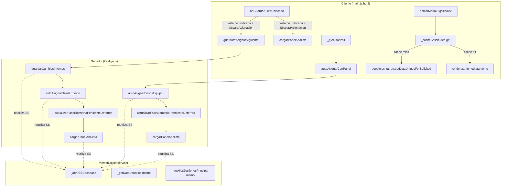

# Design Document: Round-Trip Consolidation

## Overview

Esta feature consolida los 5 patrones de multi-round-trip restantes en la aplicación, extendiendo el patrón validado por `activarYAsignar()` y `guardarYAsignarSiguiente()`. Cada consolidación elimina viajes de red secuenciales (`google.script.run`) que agregan 4-9 segundos de overhead por la comunicación del iframe de Google Apps Script.

**Estrategia central:** Reutilizar `_abrirSSCacheado()` para memoizar spreadsheets dentro de una misma ejecución del servidor, ejecutar múltiples operaciones en una sola invocación, y devolver todos los datos necesarios en un único objeto de respuesta.

**Consolidaciones:**

1. **Post-save en vista no unificada** — Reutilizar `guardarYAsignarSiguiente()` existente (misma función que usa la vista unificada)
2. **`autoAsignarConPanel()`** — Nueva función servidor que ejecuta asignación + carga de panel en un solo viaje
3. **Polling sin delay artificial** — Usar `autoAsignarConPanel()` desde el polling, eliminando el `setTimeout(2000)` + `cargarDatos()` separado
4. **Caché cliente de modal** — LRU cache en memoria para `getDataUniqueForSolicitud()`, evitando round-trips redundantes
5. **Biometría deferred server-side** — Mover `actualizarFaseBiometriaPendienteDeferred()` dentro de las funciones consolidadas

## Architecture



### Decisiones de arquitectura

1. **Reutilizar `guardarYAsignarSiguiente` existente para vista no unificada** en vez de crear una función nueva. La función ya está validada en producción para la vista unificada y su contrato cubre exactamente lo que necesita la vista no unificada.

2. **Nueva función `autoAsignarConPanel()`** separada de `activarYAsignar()` porque esta última incluye el paso de activación (`actualizarEstadoPropio('ACTIVO')`) que no corresponde al contexto del polling ni del post-save.

3. **Caché LRU client-side** en vez de `sessionStorage` porque: (a) los datos de `getDataUniqueForSolicitud()` pueden cambiar entre sesiones, (b) el caché se invalida automáticamente al guardar, y (c) un objeto en memoria evita serialización/deserialización innecesaria.

4. **Biometría deferred server-side** en vez de fire-and-forget desde el cliente: elimina un round-trip completo (4-9s) y garantiza la ejecución incluso si el usuario cierra la pestaña inmediatamente después del guardado.

## Components and Interfaces

### 1. Server-side: `autoAsignarConPanel()` (Código.js)

```javascript
/**
 * Consolida: auto-asignación + biometría deferred + carga de panel.
 * Patrón idéntico a activarYAsignar() pero sin el paso de activación.
 *
 * @returns {{ asignacion: Object, panel: Object|null }}
 *   asignacion: { success, message, nueva, idsAsignados, faseTarget, _biometriaEjecutada }
 *   panel: resultado de cargarPanelAnalista() o { _error, tabla:null, cupos:null, ... }
 */
function autoAsignarConPanel() { ... }
```

**Responsabilidades:**
- Ejecutar `autoAsignarDesdeEquipo()`
- Si hay `idsAsignados`, ejecutar `actualizarFaseBiometriaPendienteDeferred()` server-side
- Ejecutar `cargarPanelAnalista()` (reutilizando SS abiertos)
- Respetar deadline de 280s para panel y 300s total
- Retornar resultado combinado

### 2. Server-side: Modificación de `guardarYAsignarSiguiente()` (Código.js)

Agregar ejecución de `actualizarFaseBiometriaPendienteDeferred()` entre la asignación y la carga del panel, cuando `resultado.asignacion.idsAsignados.length > 0`.

### 3. Server-side: Modificación de `activarYAsignar()` (Código.js)

Agregar ejecución de `actualizarFaseBiometriaPendienteDeferred()` entre la asignación y la carga del panel, cuando `resultado.asignacion.idsAsignados.length > 0`.

### 4. Client-side: Modificación de `onGuardarExitoUnificado()` (main.js.html)

En la rama `window.__IS_UNIFIED_VIEW__ === false`:
- Si `r.disparaAsignacion === true`: invocar `guardarYAsignarSiguiente(_ultimosDatosGuardado)` con el mismo handler que usa la vista unificada
- Si `r.disparaAsignacion === false`: invocar `cargarPanelAnalista()` directo (1 round-trip)

### 5. Client-side: Modificación de `_ejecutarPoll()` (main.js.html)

Reemplazar `autoAsignarDesdeEquipo` / `autoAsignarAlEntrar` por `autoAsignarConPanel()`, eliminando el `setTimeout(2000)` + `cargarDatos()` separado.

### 6. Client-side: `_cacheSolicitudes` (main.js.html)

```javascript
/**
 * LRU Cache para resultados de getDataUniqueForSolicitud().
 * Máximo 50 entradas. Solo en memoria (no persiste entre recargas).
 */
var _cacheSolicitudes = {
  _map: new Map(),     // solicitudId → { data, timestamp }
  _inflight: new Map(), // solicitudId → [callback, callback, ...]
  MAX_SIZE: 50,

  get(solicitudId, callback) { ... },
  set(solicitudId, data) { ... },
  invalidate(solicitudId) { ... },
  _evictLRU() { ... }
};
```

**Interfaz pública:**
- `get(solicitudId, callback)`: Devuelve datos cacheados inmediatamente o lanza la petición al servidor y llama al callback cuando llegan. Deduplicates peticiones en vuelo.
- `set(solicitudId, data)`: Almacena resultado exitoso.
- `invalidate(solicitudId)`: Elimina entrada tras guardado exitoso.

### 7. Client-side: Modificación de `_dispararAutoAsignacion()` (main.js.html)

Usar `autoAsignarConPanel()` para que el resultado incluya el panel, eliminando el `cargarDatos()` posterior.

## Data Models

### Respuesta de `autoAsignarConPanel()`

```javascript
{
  asignacion: {
    success: Boolean,       // ¿Se pudo ejecutar la asignación?
    message: String,        // Mensaje para el usuario
    nueva: Boolean,         // ¿Se asignó un caso nuevo?
    idsAsignados: [String], // IDs de solicitudes asignadas (para biometría)
    faseTarget: String|null,// Fase destino para biometría ("ASIGNADA")
    _biometriaEjecutada: Boolean // ¿Se ejecutó deferred server-side?
  },
  panel: {
    // Misma estructura que retorna cargarPanelAnalista()
    tabla: Object|null,
    cupos: Object|null,
    pendientesValidacion: Array,
    gestionesHoyCruzadas: Object|null,
    estadoActual: String,
    infoTurno: Object,
    permisoVigente: Object,
    yaAlmorzo: Boolean,
    motivosAplazamiento: Array,
    motivosNegacion: Array,
    _error: String|undefined  // Solo si cargarPanelAnalista() falló
  }
}
```

### Estructura del LRU Cache client-side

```javascript
// Entrada individual
{
  data: Object,      // Resultado de getDataUniqueForSolicitud (con success:true)
  lastAccess: Number // Date.now() al momento del último acceso (para LRU eviction)
}

// Peticiones en vuelo (deduplicación)
// Map<solicitudId, Array<Function>> donde cada Function es un callback pendiente
```

### Modificación a respuesta de `guardarYAsignarSiguiente()` y `activarYAsignar()`

Campo adicional en `resultado.asignacion`:
```javascript
_biometriaEjecutada: Boolean // true si se ejecutó server-side, false si falló
```

## Correctness Properties

*A property is a characteristic or behavior that should hold true across all valid executions of a system — essentially, a formal statement about what the system should do. Properties serve as the bridge between human-readable specifications and machine-verifiable correctness guarantees.*

### Property 1: Response structure of autoAsignarConPanel

*For any* execution of `autoAsignarConPanel()` — regardless of whether the assignment succeeds, fails, or throws an exception, and regardless of whether the panel loads successfully or errors — the returned object SHALL always contain exactly two top-level properties: `asignacion` (an object with at least `success`, `message`, `nueva`, `idsAsignados`, `faseTarget`, and `_biometriaEjecutada`) and `panel` (an object or null).

**Validates: Requirements 2.5, 6.1, 6.3**

### Property 2: Cache hit returns data without network call

*For any* `solicitudId` that exists as an entry in the `_cacheSolicitudes` cache, calling `_cacheSolicitudes.get(solicitudId, callback)` SHALL invoke the callback with the cached data and SHALL NOT trigger a `google.script.run` invocation.

**Validates: Requirements 4.1**

### Property 3: Cache miss triggers fetch and stores result

*For any* `solicitudId` that does NOT exist in the `_cacheSolicitudes` cache and has no inflight request, calling `_cacheSolicitudes.get(solicitudId, callback)` SHALL trigger exactly one `google.script.run.getDataUniqueForSolicitud` invocation, and upon receiving a response with `success=true`, SHALL store the result in the cache indexed by that `solicitudId`.

**Validates: Requirements 4.2**

### Property 4: Inflight request deduplication

*For any* `solicitudId` that has an inflight request pending, subsequent calls to `_cacheSolicitudes.get(solicitudId, callback)` SHALL NOT launch additional `google.script.run` invocations, and SHALL resolve all pending callbacks with the same result when the original request completes.

**Validates: Requirements 4.3**

### Property 5: Failed responses never cached

*For any* `solicitudId` whose `getDataUniqueForSolicitud` call returns `success=false`, the `_cacheSolicitudes` SHALL NOT contain an entry for that `solicitudId` after the response is processed.

**Validates: Requirements 4.4**

### Property 6: Cache invalidation on successful save

*For any* `solicitudId` for which a save operation completes with `success=true`, the corresponding entry in `_cacheSolicitudes` SHALL be removed immediately, such that the next `get()` call for that `solicitudId` triggers a fresh server request.

**Validates: Requirements 4.5**

### Property 7: LRU eviction at capacity

*For any* sequence of cache operations, the `_cacheSolicitudes` SHALL never contain more than 50 entries. When a 51st unique entry is inserted, the entry with the oldest `lastAccess` timestamp SHALL be evicted.

**Validates: Requirements 4.8**

### Property 8: Biometría client routing based on _biometriaEjecutada

*For any* server response from `autoAsignarConPanel`, `guardarYAsignarSiguiente`, or `activarYAsignar` where `asignacion.idsAsignados` has at least one element: if `asignacion._biometriaEjecutada === true`, the client SHALL NOT invoke `actualizarFaseBiometriaPendienteDeferred`; if `asignacion._biometriaEjecutada` is absent or `false`, the client SHALL invoke `actualizarFaseBiometriaPendienteDeferred(idsAsignados, faseTarget)` as fire-and-forget.

**Validates: Requirements 5.5, 5.7, 5.8**

## Error Handling

### Server-side errors

| Escenario | Manejo | Impacto en respuesta |
|-----------|--------|---------------------|
| `autoAsignarDesdeEquipo()` lanza excepción | Try/catch, loguear, continuar | `asignacion.success=false`, `idsAsignados=[]`, `faseTarget=null` |
| `cargarPanelAnalista()` lanza excepción | Try/catch, loguear | `panel._error = mensaje`, con defaults para tabla/cupos/etc |
| `actualizarFaseBiometriaPendienteDeferred()` lanza excepción | Try/catch, loguear, `_biometriaEjecutada=false` | No afecta al cliente; el fallback client-side re-intenta |
| Timeout de 280s pre-panel | Early return | `panel=null`, cliente usa `cargarDatos()` |
| Timeout de 300s total | Early return | Resultado parcial retornado |
| `guardarCambiosInternos()` falla | Early return sin asignar/panel | `guardado.success=false`, asignacion/panel = null |

### Client-side errors

| Escenario | Manejo | UX |
|-----------|--------|-----|
| `google.script.run` failure handler | `cargarDatos()` como fallback | Toast de error + recarga normal |
| Panel recibido con `_error` | `cargarDatos()` | Transparente para el usuario |
| Panel nulo | `cargarDatos()` | Transparente para el usuario |
| Cache miss + network error | No cachear, permitir retry | Modal muestra spinner de nuevo en próximo intento |
| Polling failure | Backoff exponencial (hasta 360s) | Banner de polling sigue visible |

### Principios de diseño de error handling

1. **Degradación graceful:** Cada función consolidada puede fallar parcialmente sin afectar las partes que sí funcionaron.
2. **Fallback transparente:** Si el panel consolidado falla, `cargarDatos()` hace un viaje separado — el usuario experimenta latencia adicional pero nunca se queda sin datos.
3. **Biometría resiliente:** El doble-check (server-side + client-side fallback) garantiza que la fase se actualiza eventualmente.
4. **Sin pérdida de datos:** El guardado es el primer paso; si falla, nada más se ejecuta y el usuario recibe feedback inmediato.

## Testing Strategy

### Unit Tests (example-based)

- **Post-save routing (vista no unificada):** Verificar que `onGuardarExitoUnificado` invoca `guardarYAsignarSiguiente` cuando `disparaAsignacion=true` y `window.__IS_UNIFIED_VIEW__===false`.
- **Toast display logic:** Verificar los 3 casos de toast post-asignación (nueva=true → info, success=false → warning, null/nueva=false → no toast).
- **Polling path:** Verificar que `_ejecutarPoll` usa `autoAsignarConPanel` y no el flujo con setTimeout.
- **Fallback paths:** Verificar que panel nulo/con error dispara `cargarDatos()`.
- **Deadline behavior:** Verificar que 280s pre-panel retorna panel=null.

### Property-Based Tests

Usar **fast-check** (ya disponible como dependencia de desarrollo del proyecto via vitest) para validar las propiedades universales del LRU cache y la lógica de routing de biometría.

**Configuración:**
- Mínimo 100 iteraciones por propiedad
- Cada test referencia su propiedad del design document
- Tag format: **Feature: round-trip-consolidation, Property {N}: {título}**

**Propiedades a implementar:**

1. **Property 1 (Response structure):** Generar combinaciones de éxito/fallo de autoAsignar y cargarPanel, verificar que el objeto siempre tiene exactamente `{asignacion, panel}` con los campos requeridos.
2. **Property 2 (Cache hit):** Generar solicitudIds aleatorios, popular cache, verificar que `get()` no dispara llamada de red.
3. **Property 3 (Cache miss + store):** Generar solicitudIds no cacheados, verificar fetch + almacenamiento.
4. **Property 4 (Inflight dedup):** Generar solicitudIds con estado inflight, verificar que no se duplica la petición.
5. **Property 5 (No cache on failure):** Generar respuestas con `success=false`, verificar que no se almacenan.
6. **Property 6 (Invalidation on save):** Generar solicitudIds cacheados, ejecutar invalidación post-save, verificar remoción.
7. **Property 7 (LRU eviction):** Generar secuencias de >50 inserciones con patrones de acceso variados, verificar que tamaño nunca excede 50 y que la entrada evictada es la LRU.
8. **Property 8 (Biometría routing):** Generar respuestas con combinaciones de `_biometriaEjecutada` y `idsAsignados`, verificar que el fire-and-forget se ejecuta o se omite correctamente.

### Integration Tests

- **`autoAsignarConPanel()` end-to-end:** Con mocks de SpreadsheetApp, verificar que la función completa su orquestación y devuelve el formato correcto.
- **`guardarYAsignarSiguiente()` con biometría deferred:** Verificar que `actualizarFaseBiometriaPendienteDeferred` se llama cuando hay IDs.
- **`activarYAsignar()` con biometría deferred:** Misma verificación.
- **Performance:** Verificar que el tiempo de ejecución no supera 90s bajo condiciones simuladas normales.

