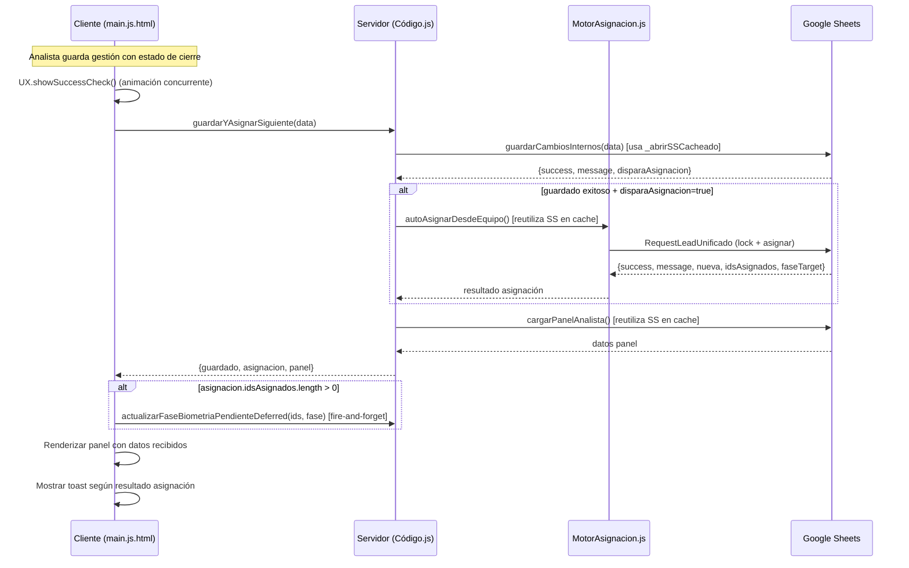
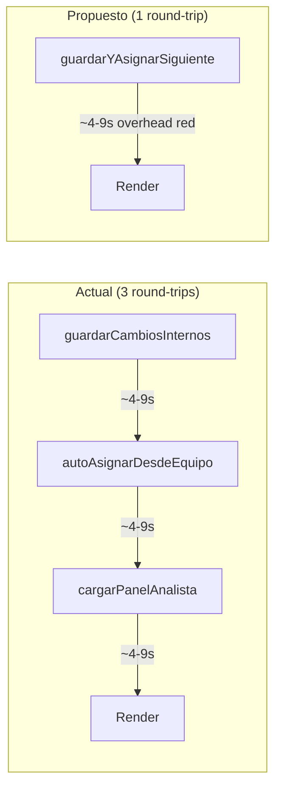

# Design Document: save-and-assign-next

## Overview

Esta feature consolida el flujo post-guardado del analista en una sola llamada servidor. Actualmente, después de guardar una gestión con estado de cierre (APROBADO/NEGADO/RECHAZADO/APLAZADO), el cliente ejecuta 3 round-trips secuenciales:

1. `guardarCambiosInternos(data)` — guarda la gestión
2. `_dispararAutoAsignacion()` → `autoAsignarDesdeEquipo()` — asigna el siguiente caso
3. `cargarDatos()` → `cargarPanelAnalista()` — recarga el panel completo

Cada round-trip agrega ~4-9s de latencia de red del iframe de Google Apps Script, produciendo 13-27s de espera total. La nueva función `guardarYAsignarSiguiente()` ejecuta las 3 operaciones en una sola ejecución servidor, eliminando 2 round-trips y reutilizando spreadsheets ya abiertos durante el guardado para la fase de asignación.

El patrón ya está validado por `activarYAsignar()` (Código.js:3287) que consolida activación + asignación + panel en una sola llamada.

### Decisiones de Diseño

1. **No modificar `guardarCambiosInternos()`**: La función existente se invoca desde múltiples puntos (vista no unificada, admin, tests). La consolidación se implementa como wrapper que la llama internamente.
2. **Reutilización via `_abrirSSCacheado()`**: El mecanismo de memoización ya existe y funciona a nivel de ejecución. Al ejecutar guardar + asignar + panel en la misma ejecución, los spreadsheets abiertos en el paso 1 se reutilizan automáticamente sin cambios al cache.
3. **Fallo parcial tolerado**: Igual que `activarYAsignar()`, si la asignación o el panel fallan después del guardado exitoso, se retorna el resultado parcial — nunca se revierte el guardado.
4. **Feature flag implícito via `window.__IS_UNIFIED_VIEW__`**: La vista no unificada mantiene el flujo existente de 3 llamadas separadas.

## Architecture



### Flujo actual vs. propuesto



## Components and Interfaces

### Backend: Nueva función `guardarYAsignarSiguiente(data)`

**Ubicación:** `Código.js` (junto a `activarYAsignar()`)

**Firma:**
```javascript
/**
 * Consolida: guardar gestión + auto-asignar siguiente + cargar panel.
 * Patrón idéntico a activarYAsignar() pero reemplazando activación por guardado.
 * 
 * @param {Object} data - Mismos datos que recibe guardarCambiosInternos()
 * @returns {{guardado: Object, asignacion: Object|null, panel: Object|null}}
 */
function guardarYAsignarSiguiente(data) { ... }
```

**Contrato de entrada (data):**
```javascript
{
  solicitudId: string,           // ID de la solicitud (requerido)
  estado_q: string,              // Estado final (APROBADO|NEGADO|RECHAZADO|APLAZADO|...)
  motivo_aplazamiento: string,   // Requerido si estado=APLAZADO
  motivo_negacion: string,       // Requerido si estado=NEGADO|RECHAZADO
  biometria: string,             // Resultado biometría
  comentarios_gestion: string,   // Observaciones del analista
  tipoSolicitudActual: string,   // digital|reestudio|desaplazamiento|induccion|...
  fecha_radicacion_sai: string,  // Fecha radicación SAI
  poliza: string                 // Póliza (requerido en reestudios)
}
```

**Contrato de salida:**
```javascript
{
  guardado: {
    success: boolean,
    message: string,
    disparaAsignacion: boolean,
    usuario?: string
  },
  asignacion: {                    // null si guardado falla o no dispara asignación
    success: boolean,
    message: string,
    nueva?: boolean,
    idsAsignados: string[],
    faseTarget: string|null
  } | null,
  panel: {                         // null si guardado falla; objeto con defaults si panel falla
    tabla: Object|null,
    cupos: Object|null,
    pendientesValidacion: Array,
    gestionesHoyCruzadas: Object|null,
    estadoActual: string,
    infoTurno: Object,
    permisoVigente: Object,
    yaAlmorzo: boolean,
    motivosAplazamiento: Array,
    motivosNegacion: Array,
    _error?: string               // Presente solo si cargarPanelAnalista falló
  } | null
}
```

### Frontend: Modificación de `onGuardarExitoUnificado()`

**Ubicación:** `main.js.html`

**Cambios:**
- Cuando `window.__IS_UNIFIED_VIEW__ === true` y `r.disparaAsignacion === true`: invocar `guardarYAsignarSiguiente(data)` en lugar de `_dispararAutoAsignacion()` + `cargarDatos()`.
- Cuando `window.__IS_UNIFIED_VIEW__ === true` y `r.disparaAsignacion === false`: invocar `cargarPanelAnalista()` directamente (1 round-trip en vez de cargarDatos que hace lo mismo).
- `UX.showSuccessCheck()` se lanza de forma concurrente (no espera a la respuesta servidor).

### Frontend: Nueva función `_guardarYAsignarConsolidado(data)`

**Ubicación:** `main.js.html`

**Responsabilidades:**
1. Invocar `google.script.run.guardarYAsignarSiguiente(data)`
2. En éxito: renderizar panel, disparar biometría deferred si aplica, mostrar toast
3. En fallo: mostrar error y llamar `cargarDatos()` como fallback

### Frontend: Lógica de toasts por resultado

| Condición | Tipo toast | Mensaje | Auto-dismiss |
|-----------|-----------|---------|-------------|
| `asignacion.success && asignacion.nueva` | info | `asignacion.message` | 5000ms |
| `asignacion.success && !asignacion.nueva` | (ninguno) | — | — |
| `asignacion.success === false` | warning | `asignacion.message` | 5000ms |
| `asignacion === null` | (ninguno, solo toast guardado) | — | — |

## Data Models

### Objeto de respuesta consolidada

No se introducen nuevos modelos de datos. La respuesta es una composición de las interfaces ya existentes:

```javascript
// Tipo conceptual (no hay TypeScript en GAS, pero documenta la estructura)
/**
 * @typedef {Object} RespuestaConsolidada
 * @property {ResultadoGuardado} guardado
 * @property {ResultadoAsignacion|null} asignacion
 * @property {DatosPanel|null} panel
 */

/**
 * @typedef {Object} ResultadoGuardado
 * @property {boolean} success
 * @property {string} message
 * @property {boolean} disparaAsignacion
 * @property {string} [usuario]
 */

/**
 * @typedef {Object} ResultadoAsignacion
 * @property {boolean} success
 * @property {string} message
 * @property {boolean} [nueva]
 * @property {string[]} idsAsignados
 * @property {string|null} faseTarget
 */

/**
 * @typedef {Object} DatosPanel
 * @property {Object|null} tabla
 * @property {Object|null} cupos
 * @property {Array} pendientesValidacion
 * @property {Object|null} gestionesHoyCruzadas
 * @property {string} [estadoActual]
 * @property {Object} [infoTurno]
 * @property {Object} [permisoVigente]
 * @property {boolean} [yaAlmorzo]
 * @property {Array} [motivosAplazamiento]
 * @property {Array} [motivosNegacion]
 * @property {string} [_error]
 */
```

### Spreadsheets utilizados (sin cambios)

| ID Constante | Contenido | Abierto por |
|---|---|---|
| `TARGET_SOLICITUDES_SS_ID` | Hojas: solicitud, Historico_Gestiones, Usuarios, score, Turnos | guardarCambiosInternos, RequestLeadUnificado, cargarPanelAnalista |
| `ID_HOJA_REESTUDIOS` | Hojas: ORIGEN, Historico_Gestiones | guardarCambiosInternos, RequestLeadUnificado |

Ambos se benefician de `_abrirSSCacheado()` al ejecutarse en la misma invocación servidor.


## Correctness Properties

*A property is a characteristic or behavior that should hold true across all valid executions of a system — essentially, a formal statement about what the system should do. Properties serve as the bridge between human-readable specifications and machine-verifiable correctness guarantees.*

### Property 1: Output structure invariant

*For any* input data object and any combination of sub-function outcomes (save success/fail, assignment success/fail/exception, panel success/fail/exception), the return value of `guardarYAsignarSiguiente()` SHALL always be an object with exactly three properties: `guardado` (object with success boolean and message string), `asignacion` (object with success boolean, message string, idsAsignados array, and faseTarget — OR null), and `panel` (object with tabla, cupos, pendientesValidacion, gestionesHoyCruzadas — OR null).

**Validates: Requirements 1.3, 1.5, 2.5**

### Property 2: Early-exit on save failure

*For any* input data where `guardarCambiosInternos()` returns `success=false` (including solicitudId vacío/ausente, motivos faltantes, solicitud no encontrada), the consolidated function SHALL return immediately with `asignacion=null` and `panel=null`, without invoking `autoAsignarDesdeEquipo()` nor `cargarPanelAnalista()`.

**Validates: Requirements 1.4, 1.6**

### Property 3: Assignment executed if and only if closing state

*For any* valid input data where save succeeds, `autoAsignarDesdeEquipo()` SHALL be invoked if and only if `guardarCambiosInternos()` returns `disparaAsignacion=true`. When `disparaAsignacion=false`, the result SHALL have `asignacion=null` and the panel SHALL still be loaded.

**Validates: Requirements 1.1, 1.2**

### Property 4: Assignment failure never blocks panel load

*For any* scenario where save succeeds and assignment is attempted but fails (no cases available, cupos llenos, ScriptLock timeout, or unhandled exception), `cargarPanelAnalista()` SHALL still be invoked and its result included in the response. The assignment failure reason SHALL be preserved in `asignacion.message`.

**Validates: Requirements 2.1, 2.2, 2.3, 2.4**

### Property 5: Timeout produces partial result

*For any* execution where the elapsed time from start of `guardarYAsignarSiguiente()` exceeds 300 seconds without completing all three steps, the function SHALL return the results obtained so far (guardado if completed, asignacion if completed, panel=null for incomplete steps) rather than allowing a platform timeout.

**Validates: Requirements 5.4**

### Property 6: idsAsignados and faseTarget passthrough

*For any* successful assignment result from `autoAsignarDesdeEquipo()` that includes `idsAsignados` (array) and `faseTarget` (string or null), the consolidated function SHALL include these exact values unmodified in `asignacion.idsAsignados` and `asignacion.faseTarget`. When assignment is not attempted or fails, `idsAsignados` SHALL be an empty array and `faseTarget` SHALL be null.

**Validates: Requirements 6.1, 6.2**

## Error Handling

### Estrategia de fallos por capa

| Paso | Fallo | Acción | Resultado al cliente |
|------|-------|--------|---------------------|
| Validación input | solicitudId vacío | Retorno inmediato | `{guardado: {success:false, message:"..."}, asignacion: null, panel: null}` |
| Guardado | Excepción interna | Retorno inmediato | `{guardado: {success:false, message:"Error de servidor: ..."}, asignacion: null, panel: null}` |
| Asignación | Lock timeout (25s) | Catch, continuar con panel | `{guardado: ok, asignacion: {success:false, message:"Sistema ocupado..."}, panel: datos}` |
| Asignación | Sin casos disponibles | Continuar con panel | `{guardado: ok, asignacion: {success:false, message:"No hay casos..."}, panel: datos}` |
| Asignación | Cupos llenos | Continuar con panel | `{guardado: ok, asignacion: {success:false, message:"Cupos completados: ..."}, panel: datos}` |
| Asignación | Excepción no controlada | Catch, continuar con panel | `{guardado: ok, asignacion: {success:false, message: e.message}, panel: datos}` |
| Panel | Excepción | Catch, retornar defaults | `{guardado: ok, asignacion: resultado|null, panel: {_error: e.message, tabla:null, cupos:null, ...}}` |
| Deadline | >300s | Retornar parcial | Pasos completados + null para el resto |

### Frontend error handling

| Escenario | Acción cliente |
|-----------|---------------|
| `google.script.run` failure handler (red/timeout) | Mostrar error genérico + `cargarDatos()` como fallback |
| `guardado.success=false` | (No aplica — la versión actual ya maneja esto antes de invocar consolidada) |
| `panel=null` | Invocar `cargarDatos()` como recuperación |
| `panel._error` presente | Log warning + intentar renderizar con datos parciales |

### Principio: nunca revertir

El guardado es la operación crítica (no idempotente). Una vez exitoso, los pasos posteriores pueden fallar sin comprometer la integridad del dato. La gestión del analista queda registrada; la asignación y el panel son "best-effort" dentro de la misma llamada.

## Testing Strategy

### Unit Tests (example-based)

Se prueban con Vitest usando mocks de las funciones subyacentes:

| Test | Escenario | Verifica |
|------|-----------|----------|
| Routing vista unificada | `__IS_UNIFIED_VIEW__=true`, `disparaAsignacion=true` | Llama `guardarYAsignarSiguiente` |
| Routing vista no unificada | `__IS_UNIFIED_VIEW__=false`, `disparaAsignacion=true` | Llama `_dispararAutoAsignacion` + `cargarDatos` |
| Toast info | `asignacion.success=true, nueva=true` | Toast tipo info, 5000ms |
| Toast warning | `asignacion.success=false` | Toast tipo warning, 5000ms |
| Sin toast | `asignacion=null` | Solo toast de guardado |
| Sin toast (nueva=false) | `asignacion.success=true, nueva=false` | Sin toast asignación |
| Biometria deferred | `idsAsignados.length > 0` | Llama `actualizarFaseBiometriaPendienteDeferred` fire-and-forget |
| No biometria deferred | `idsAsignados=[]` | No llama biometria |
| Animación concurrente | Cualquier guardado exitoso | Animación inicia sin esperar respuesta servidor |
| Fallback en error | `withFailureHandler` triggered | Llama `cargarDatos()` |

### Property-Based Tests

Se implementan con **fast-check** (ya configurado en el proyecto vía Vitest). Cada propiedad mapea directamente a una sección de Correctness Properties arriba.

**Configuración:** Mínimo 100 iteraciones por propiedad.

**Enfoque:** Extraer la lógica de orquestación de `guardarYAsignarSiguiente()` como función pura que recibe los resultados de cada sub-paso (o funciones mock que los producen), permitiendo testear la composición sin dependencia de Google Apps Script.

| Property Test | Referencia | Genera |
|---|---|---|
| Output structure invariant | Property 1 | Combinaciones aleatorias de resultados de sub-funciones |
| Early-exit on save failure | Property 2 | Datos con solicitudId vacío/null + datos con save que retorna success=false |
| Assignment iff closing state | Property 3 | Estados aleatorios (cierre y no-cierre) con save exitoso |
| Assignment failure → panel loads | Property 4 | Tipos de fallo de asignación (exception, return success=false con mensajes variados) |
| Timeout partial result | Property 5 | Tiempos simulados > 300s en distintos puntos de la ejecución |
| idsAsignados passthrough | Property 6 | Arrays aleatorios de IDs + faseTarget strings |

**Tag format:** `Feature: save-and-assign-next, Property {N}: {title}`

### Integration Tests

Se ejecutan manualmente en el entorno de Google Apps Script (Tests.js):

1. Guardado exitoso + asignación exitosa + panel cargado (happy path completo)
2. Guardado exitoso + sin casos disponibles + panel cargado
3. Guardado fallido por solicitud no encontrada → retorno inmediato
4. Verificar que `_ssAbiertosCache` contiene ambos spreadsheets tras una ejecución completa
5. Verificar tiempos con SPERF < 90s en condiciones normales

### Estrategia de extracción para testabilidad

Para poder ejecutar property tests con Vitest (fuera del runtime de GAS), se extraerá la lógica de orquestación como función pura:

```javascript
// tests/lib/guardar-y-asignar-puro.js
function guardarYAsignarLogica({ guardarFn, asignarFn, panelFn, deadline }) {
  // Lógica pura de composición: llama guardarFn, decide si asignar,
  // maneja fallos, respeta deadline. Retorna la estructura consolidada.
}
```

Este patrón ya existe en el proyecto — `tests/lib/motor-asignacion-puro.js` extrae la lógica de selección del motor de asignación para property testing.
