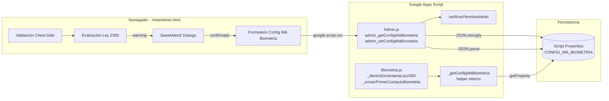

# Design Document: wa-biometria-config-admin

## Overview

Este diseño externaliza la configuración de horarios de envío de WhatsApp de biometría al panel de administración existente (VistaAdmin.html). Reemplaza los valores hardcodeados en `_dentroDeVentanaLey2300()` y la constante `VENTANA_HORAS_WA_BIOMETRIA = 4` por una lectura dinámica desde Script Properties, configurable por administradores desde la UI.

**Decisiones clave de diseño:**

1. **Sección inline en la vista admin (no modal):** A diferencia de la configuración de plantilla Infobip (que usa un SweetAlert2 modal), esta configuración es más compleja (7 checkboxes + 6 pares de hora + 1 input numérico), por lo que se implementa como una sección dedicada del panel admin con su propio enlace en el sidebar, siguiendo el patrón de secciones como "Cupos" o "Catálogo".

2. **Evaluación de Ley 2300 client-side:** El diálogo de advertencia se evalúa enteramente en JavaScript del navegador antes de invocar `google.script.run`, eliminando latencia de red para el feedback al usuario.

3. **Sin caché en el motor de biometría:** Cada ejecución de `_dentroDeVentanaLey2300()` lee la property fresca para que cambios del admin se apliquen inmediatamente sin redeploy.

4. **Fallback robusto a defaults:** Si la property no existe, es null, o no es JSON válido, el motor usa los valores históricos (L-V 7-19, Sáb 8-15, Dom deshabilitado, ventana 4h).

## Architecture



**Flujo de datos:**

1. **Lectura:** Admin abre sección → `google.script.run.admin_getConfigWaBiometria()` → `verificarPermisoAdmin()` → lee `CONFIG_WA_BIOMETRIA` de Script Properties → retorna JSON al cliente → UI renderiza formulario.

2. **Escritura:** Admin presiona Guardar → validación client-side (hora fin > hora inicio) → evaluación Ley 2300 → si hay desvíos, SweetAlert2 warning con confirmación → `google.script.run.admin_setConfigWaBiometria(config)` → `verificarPermisoAdmin()` → `JSON.stringify` + `setProperty` → retorna `{success, message}`.

3. **Consumo:** Trigger periódico ejecuta `cicloPrimerContactoBiometria()` → `_enviarPrimerContactoBiometria()` → `_dentroDeVentanaLey2300()` → `_getConfigWaBiometria()` lee property → evalúa día/hora actual contra config.

## Components and Interfaces

### Backend (Admin.js) — Funciones expuestas a `google.script.run`

```javascript
/**
 * Lee la configuración de envío WA Biometría desde Script Properties.
 * @returns {ConfigWaBiometria} Configuración actual o defaults si no existe.
 * @throws {Error} Si el usuario no tiene permiso ADMIN.
 */
function admin_getConfigWaBiometria() {
  verificarPermisoAdmin();
  return _getConfigWaBiometria();
}

/**
 * Persiste la configuración de envío WA Biometría en Script Properties.
 * @param {ConfigWaBiometria} config - Objeto de configuración validado.
 * @returns {{success: boolean, message: string}}
 */
function admin_setConfigWaBiometria(config) {
  try {
    verificarPermisoAdmin();
    // Validación server-side del esquema
    var validado = _validarConfigWaBiometria(config);
    if (!validado.ok) {
      return { success: false, message: validado.error };
    }
    var props = PropertiesService.getScriptProperties();
    props.setProperty('CONFIG_WA_BIOMETRIA', JSON.stringify(validado.config));
    return { success: true, message: "Configuración de envío WA Biometría actualizada correctamente." };
  } catch (e) {
    Logger.log("ERROR admin_setConfigWaBiometria: " + e.message);
    return { success: false, message: "No se pudo guardar la configuración. Intente de nuevo." };
  }
}
```

### Backend (Admin.js) — Funciones internas

```javascript
/**
 * Lee y parsea CONFIG_WA_BIOMETRIA desde Script Properties. Retorna defaults
 * si no existe o es inválido. Usada tanto por admin_get como por Biometria.js.
 * @returns {ConfigWaBiometria}
 */
function _getConfigWaBiometria() {
  var DEFAULTS = {
    dias: {
      lunes:    { habilitado: true,  horaInicio: "07:00", horaFin: "19:00" },
      martes:   { habilitado: true,  horaInicio: "07:00", horaFin: "19:00" },
      miercoles:{ habilitado: true,  horaInicio: "07:00", horaFin: "19:00" },
      jueves:   { habilitado: true,  horaInicio: "07:00", horaFin: "19:00" },
      viernes:  { habilitado: true,  horaInicio: "07:00", horaFin: "19:00" },
      sabado:   { habilitado: true,  horaInicio: "08:00", horaFin: "15:00" },
      domingo:  { habilitado: false, horaInicio: "08:00", horaFin: "12:00" }
    },
    ventanaHoras: 4
  };

  try {
    var props = PropertiesService.getScriptProperties();
    var raw = props.getProperty('CONFIG_WA_BIOMETRIA');
    if (!raw) return DEFAULTS;
    var parsed = JSON.parse(raw);
    if (!_validarEstructuraConfig(parsed)) {
      Logger.log("WARNING _getConfigWaBiometria: estructura JSON inválida, usando defaults.");
      return DEFAULTS;
    }
    return parsed;
  } catch (e) {
    Logger.log("WARNING _getConfigWaBiometria: " + e.message + ", usando defaults.");
    return DEFAULTS;
  }
}

/**
 * Valida estructura y tipos del objeto config recibido del cliente.
 * @param {Object} config
 * @returns {{ok: boolean, config?: ConfigWaBiometria, error?: string}}
 */
function _validarConfigWaBiometria(config) {
  // Valida existencia de propiedades requeridas
  // Valida tipos: dias es objeto con 7 claves, cada una con habilitado (bool),
  // horaInicio/horaFin (string HH:MM), ventanaHoras (entero 1-48)
  // Valida regla de negocio: horaFin > horaInicio para días habilitados
  // Retorna {ok: true, config: sanitized} o {ok: false, error: "mensaje"}
}

/**
 * Verifica que un objeto parsed tenga la estructura esperada de ConfigWaBiometria.
 * @param {Object} obj
 * @returns {boolean}
 */
function _validarEstructuraConfig(obj) {
  // Verifica: obj.dias existe, tiene 7 claves de días,
  // cada día tiene habilitado (bool), horaInicio (string), horaFin (string)
  // obj.ventanaHoras es entero entre 1 y 48
}
```

### Backend (Biometria.js) — Funciones modificadas

```javascript
/**
 * MODIFICADA: Evalúa si el momento actual está dentro de la ventana configurada
 * para envío de WhatsApp. Lee config dinámica de Script Properties.
 * @returns {boolean} true si se puede enviar ahora.
 */
function _dentroDeVentanaLey2300() {
  var ahora = new Date();
  var config = _getConfigWaBiometria();

  var fechaStr = Utilities.formatDate(ahora, "GMT-5", "yyyy-MM-dd");
  var dow = new Date(fechaStr + "T12:00:00").getDay(); // 0=dom, 1=lun ... 6=sáb
  var nombreDia = ['domingo','lunes','martes','miercoles','jueves','viernes','sabado'][dow];
  var diaConfig = config.dias[nombreDia];

  if (!diaConfig || !diaConfig.habilitado) {
    // Si el día está deshabilitado, verificar festivos para log informativo
    _verificarFestivoParaLog(fechaStr);
    return false;
  }

  var horaStr = Utilities.formatDate(ahora, "GMT-5", "HH:mm");
  var horaNum = _horaANumero(horaStr);
  var inicioNum = _horaANumero(diaConfig.horaInicio);
  var finNum = _horaANumero(diaConfig.horaFin);

  return horaNum >= inicioNum && horaNum < finNum;
}

/**
 * Convierte "HH:MM" a número decimal (ej: "08:30" → 8.5).
 */
function _horaANumero(horaStr) {
  var partes = horaStr.split(':');
  return parseInt(partes[0], 10) + parseInt(partes[1], 10) / 60;
}
```

```javascript
// En _enviarPrimerContactoBiometria(), reemplazar:
//   horasDesdeResultado < VENTANA_HORAS_WA_BIOMETRIA
// por:
//   horasDesdeResultado < config.ventanaHoras
// donde config = _getConfigWaBiometria() se lee al inicio de la función.
```

### Frontend (VistaAdmin.html) — Sección de UI

**Sidebar:** Se agrega un enlace "WA Biometría" en la sección de menú del sidebar, después de "Catálogo":

```html
<a href="#" id="link-wabiometria" class="nav-link-admin" onclick="mostrarSeccion('wabiometria', event)">
    <i class="bi bi-whatsapp"></i><span class="nav-text">WA Biometría</span>
</a>
```

**Sección HTML:** Una `<div id="seccion-wabiometria" class="seccion-admin" style="display:none;">` con:
- Header con título e ícono
- Nota informativa Ley 2300 (card con borde amarillo)
- Grid de configuración por día (7 filas: checkbox + selects hora inicio/fin)
- Input numérico para ventana de horas
- Botón guardar con spinner

### Frontend (VistaAdmin.html) — Funciones JavaScript

```javascript
/**
 * Carga la configuración actual del servidor y renderiza el formulario.
 */
function cargarConfigWaBiometria() { ... }

/**
 * Recolecta valores del formulario en un objeto ConfigWaBiometria.
 * @returns {ConfigWaBiometria}
 */
function _recolectarFormWaBiometria() { ... }

/**
 * Valida que horaFin > horaInicio para cada día habilitado.
 * @param {ConfigWaBiometria} config
 * @returns {{valido: boolean, errores: string[]}}
 */
function _validarHorariosWaBiometria(config) { ... }

/**
 * Evalúa desviaciones contra los límites de referencia Ley 2300.
 * @param {ConfigWaBiometria} config
 * @returns {string[]} Lista de desviaciones detectadas (vacía si cumple).
 */
function _evaluarDesviacionesLey2300(config) { ... }

/**
 * Orquesta el flujo de guardado: validar → evaluar Ley 2300 → confirmar si aplica → enviar.
 */
function guardarConfigWaBiometria() { ... }
```

## Data Models

### ConfigWaBiometria — JSON Schema

```json
{
  "$schema": "http://json-schema.org/draft-07/schema#",
  "title": "ConfigWaBiometria",
  "description": "Configuración de ventana de envío de WhatsApp de biometría",
  "type": "object",
  "required": ["dias", "ventanaHoras"],
  "additionalProperties": false,
  "properties": {
    "dias": {
      "type": "object",
      "required": ["lunes", "martes", "miercoles", "jueves", "viernes", "sabado", "domingo"],
      "additionalProperties": false,
      "properties": {
        "lunes":     { "$ref": "#/$defs/DiaConfig" },
        "martes":    { "$ref": "#/$defs/DiaConfig" },
        "miercoles": { "$ref": "#/$defs/DiaConfig" },
        "jueves":    { "$ref": "#/$defs/DiaConfig" },
        "viernes":   { "$ref": "#/$defs/DiaConfig" },
        "sabado":    { "$ref": "#/$defs/DiaConfig" },
        "domingo":   { "$ref": "#/$defs/DiaConfig" }
      }
    },
    "ventanaHoras": {
      "type": "integer",
      "minimum": 1,
      "maximum": 48,
      "description": "Horas mínimas desde fecha_resultado antes del primer contacto WA"
    }
  },
  "$defs": {
    "DiaConfig": {
      "type": "object",
      "required": ["habilitado", "horaInicio", "horaFin"],
      "additionalProperties": false,
      "properties": {
        "habilitado": {
          "type": "boolean",
          "description": "Si el envío está permitido este día"
        },
        "horaInicio": {
          "type": "string",
          "pattern": "^([01]\\d|2[0-3]):(00|30)$",
          "description": "Hora de inicio en formato HH:MM (incrementos de 30 min)"
        },
        "horaFin": {
          "type": "string",
          "pattern": "^([01]\\d|2[0-3]):(00|30)$",
          "description": "Hora de fin en formato HH:MM (incrementos de 30 min)"
        }
      }
    }
  }
}
```

### Ejemplo de valor almacenado en Script Properties

Clave: `CONFIG_WA_BIOMETRIA`

```json
{
  "dias": {
    "lunes":     { "habilitado": true,  "horaInicio": "07:00", "horaFin": "19:00" },
    "martes":    { "habilitado": true,  "horaInicio": "07:00", "horaFin": "19:00" },
    "miercoles": { "habilitado": true,  "horaInicio": "07:00", "horaFin": "19:00" },
    "jueves":    { "habilitado": true,  "horaInicio": "07:00", "horaFin": "19:00" },
    "viernes":   { "habilitado": true,  "horaInicio": "07:00", "horaFin": "19:00" },
    "sabado":    { "habilitado": true,  "horaInicio": "08:00", "horaFin": "15:00" },
    "domingo":   { "habilitado": false, "horaInicio": "08:00", "horaFin": "12:00" }
  },
  "ventanaHoras": 4
}
```

### Constantes de defaults (en código)

```javascript
var CONFIG_WA_BIOMETRIA_DEFAULTS = {
  dias: {
    lunes:     { habilitado: true,  horaInicio: "07:00", horaFin: "19:00" },
    martes:    { habilitado: true,  horaInicio: "07:00", horaFin: "19:00" },
    miercoles: { habilitado: true,  horaInicio: "07:00", horaFin: "19:00" },
    jueves:    { habilitado: true,  horaInicio: "07:00", horaFin: "19:00" },
    viernes:   { habilitado: true,  horaInicio: "07:00", horaFin: "19:00" },
    sabado:    { habilitado: true,  horaInicio: "08:00", horaFin: "15:00" },
    domingo:   { habilitado: false, horaInicio: "08:00", horaFin: "12:00" }
  },
  ventanaHoras: 4
};
```


## Correctness Properties

*A property is a characteristic or behavior that should hold true across all valid executions of a system — essentially, a formal statement about what the system should do. Properties serve as the bridge between human-readable specifications and machine-verifiable correctness guarantees.*

### Property 1: Validation rejects invalid time ranges

*For any* ConfigWaBiometria object where at least one enabled day has `horaFin` ≤ `horaInicio`, the validation function `_validarConfigWaBiometria` SHALL return `{ok: false}` and the client-side `_validarHorariosWaBiometria` SHALL return `{valido: false}` with an error message identifying the offending day(s).

**Validates: Requirements 1.6**

### Property 2: Ley 2300 deviation detection is sound and complete

*For any* ConfigWaBiometria object, the function `_evaluarDesviacionesLey2300` SHALL return a non-empty array if and only if at least one of the following conditions holds: (a) any weekday (lunes–viernes) has `horaInicio` < "07:00" or `horaFin` > "19:00", (b) sábado has `horaInicio` < "08:00" or `horaFin` > "15:00", (c) domingo has `habilitado` = true. Furthermore, each deviation present in the config SHALL have a corresponding entry in the returned array.

**Validates: Requirements 2.1, 2.2, 2.3, 2.4, 2.8**

### Property 3: Time-window evaluation correctness

*For any* valid ConfigWaBiometria and any date/time instant, `_dentroDeVentanaLey2300` SHALL return `true` if and only if the day-of-week in the config has `habilitado` = true AND the current hour (decimal) satisfies `horaInicio ≤ hora < horaFin`.

**Validates: Requirements 4.1, 4.6**

### Property 4: VentanaHoras comparison uses configured value

*For any* integer `ventanaHoras` (1–48) stored in config and any `horasDesdeResultado` value, the primer contacto filter SHALL skip a candidate if and only if `horasDesdeResultado < ventanaHoras`. No hardcoded constant shall override the configured value.

**Validates: Requirements 4.2**

### Property 5: Fallback to defaults on invalid config

*For any* string value stored in the `CONFIG_WA_BIOMETRIA` Script Property that is either: not valid JSON, valid JSON but missing the `dias` key, valid JSON but missing `ventanaHoras`, or has type-incorrect values (e.g., `habilitado` is a string instead of boolean), the function `_getConfigWaBiometria` SHALL return the exact default config object (L-V 7-19, Sáb 8-15, Dom disabled, ventanaHoras=4).

**Validates: Requirements 4.4, 5.1, 5.2, 5.3**

### Property 6: Enabled days override festivo blocking

*For any* ConfigWaBiometria where a given day is `habilitado: true`, and that day happens to be a Colombian festivo (present in the "Festivos" sheet), `_dentroDeVentanaLey2300` SHALL still return `true` when the current time is within the configured range for that day's type (by day-of-week).

**Validates: Requirements 4.7**

## Error Handling

### Server-side (Admin.js)

| Escenario | Comportamiento | Respuesta al cliente |
|-----------|---------------|---------------------|
| Usuario sin permiso ADMIN | `verificarPermisoAdmin()` lanza excepción | `withFailureHandler` recibe error "Acceso Denegado" |
| JSON inválido recibido del cliente | `_validarConfigWaBiometria` detecta estructura incorrecta | `{success: false, message: "La configuración no tiene el formato esperado."}` |
| horaFin ≤ horaInicio en día habilitado | `_validarConfigWaBiometria` detecta regla de negocio violada | `{success: false, message: "La hora de fin debe ser posterior a la hora de inicio para [día]."}` |
| ventanaHoras fuera de rango 1-48 | `_validarConfigWaBiometria` detecta rango inválido | `{success: false, message: "La ventana de horas debe estar entre 1 y 48."}` |
| Excepción al escribir Script Properties | try/catch en `admin_setConfigWaBiometria` | `{success: false, message: "No se pudo guardar la configuración. Intente de nuevo."}` + `Logger.log` con detalle |
| Excepción al leer Script Properties (en Biometria.js) | try/catch en `_getConfigWaBiometria` | Usa defaults silenciosamente + `Logger.log` WARNING |
| JSON válido pero estructura incorrecta (en Biometria.js) | `_validarEstructuraConfig` retorna false | Usa defaults + `Logger.log` WARNING |

### Client-side (VistaAdmin.html)

| Escenario | Comportamiento |
|-----------|---------------|
| horaFin ≤ horaInicio | SweetAlert2 error con mensaje descriptivo, no se envía al servidor |
| Desviación Ley 2300 detectada | SweetAlert2 warning con lista de desviaciones + botones Confirmar/Cancelar |
| `withFailureHandler` (error de red/timeout) | SweetAlert2 error "Fallo de comunicación con el servidor" + rehabilitar botón |
| Respuesta `{success: false}` del servidor | SweetAlert2 error con `res.message` |
| Timeout de 30 segundos sin respuesta | Rehabilitar botón + SweetAlert2 error |

### Principios de error handling

1. **Nunca exponer detalles internos al usuario:** Mensajes genéricos en la respuesta, detalles en `Logger.log`.
2. **Preservar estado del formulario:** Ningún error borra los datos ingresados por el admin.
3. **Doble validación:** Client-side para UX inmediata, server-side para seguridad (nunca confiar en el cliente).
4. **Fallback graceful:** El motor de biometría SIEMPRE tiene un comportamiento válido (defaults) ante cualquier fallo de lectura de config.

## Testing Strategy

### Property-Based Tests (Vitest + fast-check)

Se extraen las funciones puras de lógica a un módulo testeable (`tests/lib/wa-biometria-config-puro.js`) que replica la lógica sin dependencias de Google Apps Script (sin `PropertiesService`, `Utilities`, `SpreadsheetApp`).

**Funciones a testear con PBT:**
- `validarConfigWaBiometria(config)` — Property 1 y parte de Property 5
- `evaluarDesviacionesLey2300(config)` — Property 2
- `dentroDeVentana(config, dow, horaDecimal)` — Property 3
- `cumpleVentanaHoras(ventanaHoras, horasDesdeResultado)` — Property 4
- `getConfigConDefaults(rawString)` — Property 5

**Configuración:**
- **Librería PBT:** fast-check 4.1.1 (ya instalada en el proyecto)
- **Runner:** Vitest 3.2.7 (ya configurado)
- **Iteraciones:** Mínimo 100 por property (default de fast-check)
- **Tag format:** `// Feature: wa-biometria-config-admin, Property {N}: {título}`

### Unit Tests (example-based)

- Verificar que `_getConfigWaBiometria()` retorna defaults exactos cuando property no existe
- Verificar estructura de respuesta de `admin_setConfigWaBiometria` en happy path
- Verificar que festivos se loguean pero no bloquean cuando el día está habilitado
- Verificar formato de mensajes de error (genérico al cliente)

### Integration Tests (manual/script)

- Guardar config → leer config → verificar round-trip
- Verificar que `verificarPermisoAdmin()` bloquea usuarios no-admin
- Verificar que el trigger `cicloPrimerContactoBiometria` usa la config guardada

### Test File Structure

```
tests/
  lib/
    wa-biometria-config-puro.js      # Lógica pura extraída (sin deps GAS)
  properties/
    wa-biometria-config.property.test.js  # Properties 1-5
```
